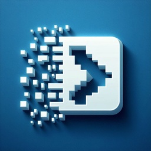
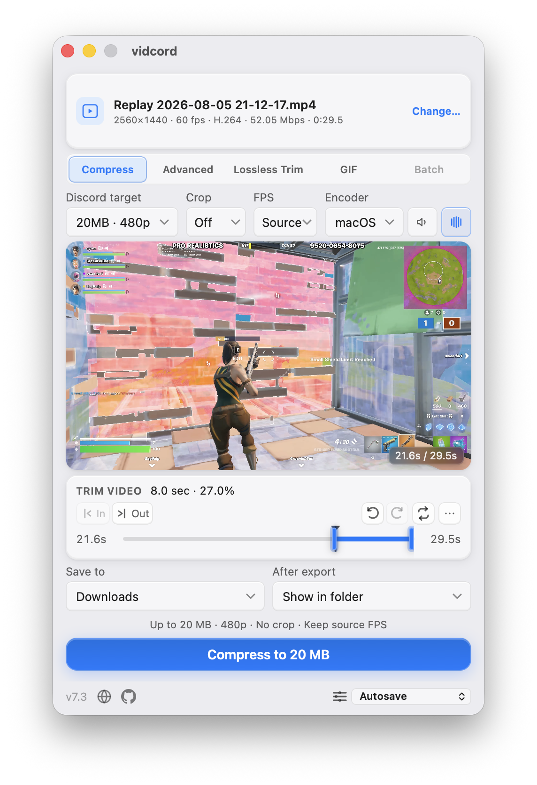
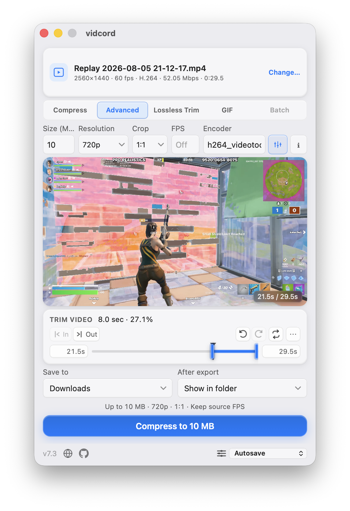
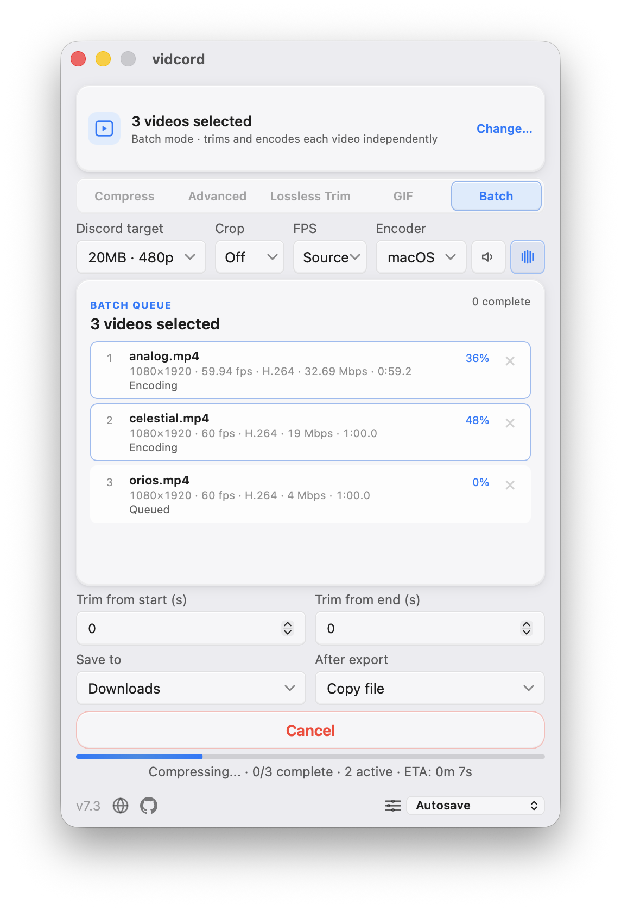
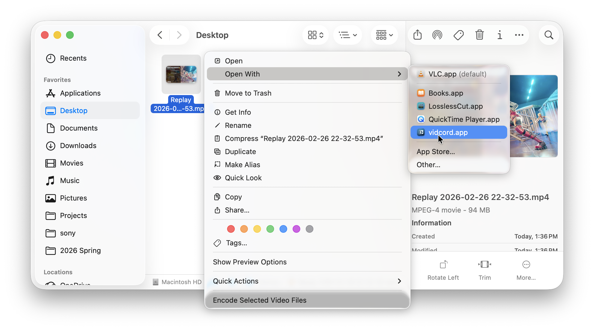

# vidcord - Free Discord Video Compressor for Web, Windows, macOS, and Linux

<p>
  
</p>

**vidcord** is a free, open-source, browser-first **Discord video compressor**.
Open [vidcord.app](https://vidcord.app/) to compress selected videos locally in
your browser with FFmpeg WebAssembly: choose a **20 MB, 50 MB, 100 MB, or
500 MB** target, trim the clip, or choose **Lossless Trim** to cut on source
keyframes without re-encoding. Finished files download through the browser;
selected videos never leave the device. GIF Mode creates animated `.gif`
exports with **5 MB**, **10 MB**, or **20 MB** size targets.

Download the optional [native desktop app](https://vidcord.app/#download) when
you want faster system encoding, GPU encoders, native folders, Open With,
notifications, and the complete desktop workflow. The browser editor remains
the no-install product home, while Windows, macOS, and Linux installers add
OS-level features.

Select multiple videos through the browser's file picker or drag-and-drop to
enter browser **Batch mode** automatically. The browser queue applies the same
standard Compress profile to each full-duration video and downloads each MP4.
The desktop app additionally supports Open With, command-line file arguments,
second-instance forwarding, per-video batch trims, native output handling, and
native parallel workers.

The native desktop app supports **MP4, MOV, MKV, AVI, WebM, FLV, WMV**, and
other formats handled by your system [FFmpeg](https://ffmpeg.org) install. It
adds hardware-accelerated encoding (NVIDIA NVENC, AMD AMF, Intel Quick Sync,
Linux VAAPI, Apple VideoToolbox), automatic bitrate calculation, strict output
size checks, output FPS controls, and platform-native installers. Both editions
process locally with no accounts, uploads, or telemetry. The desktop app is
built with [Tauri 2](https://tauri.app) (Rust + React); the browser edition is
the same React frontend paired with FFmpeg WebAssembly.

<p>
  
  
  
  
  
  
</p>



> **At a glance** — Browser editor at [vidcord.app](https://vidcord.app/) · No
> install, no uploads, local FFmpeg WebAssembly, browser downloads · Optional
> desktop app for Windows 10/11, macOS 11+, and Linux · x86_64 + aarch64 ·
> Native installers · Discord targets 20 / 50 / 100 / 500 MB · Hardware
> acceleration and OS integrations on desktop · Desktop requires system FFmpeg
> on `PATH` · MIT licensed.

---

## Contents

- [Why vidcord](#why-vidcord)
- [Best for](#best-for)
- [Features](#features)
- [Screenshots](#screenshots)
- [Download vidcord](#download-vidcord)
- [Browser edition](#browser-edition)
- [FFmpeg setup](#ffmpeg-setup-for-the-desktop-app)
- [Usage](#usage)
- [Keyboard shortcuts](#native-desktop-keyboard-shortcuts)
- [Hardware acceleration](#hardware-acceleration)
- [Building from source](#building-from-source)
- [Project layout](#project-layout)
- [Troubleshooting](#troubleshooting)
- [FAQ](#faq)
- [Contributors](#contributors)
- [Contributing](#contributing)
- [License](#license)
- [Acknowledgements](#acknowledgements)

---

## Why vidcord

Discord's current upload limits are 20 MB (free), 50 MB (Nitro Basic /
Boost Level 2), 100 MB (Boost Level 3), and 500 MB (Nitro). Both editions pick
a target bitrate for the clip length you want and verify the result against the
selected size limit. The browser edition keeps the input in the page and
downloads the export through the browser. The desktop app can choose from the
video encoders exposed by system FFmpeg, save to **Downloads** by default or
another native destination, copy the finished file to the system clipboard,
and retry oversized results with safer bitrates and CPU fallback.

- **Platform-native packaging.** Tauri uses the system WebView (Edge on Windows,
  WebKit on macOS/Linux) instead of bundling Chromium. Package size varies by
  platform: Windows installers are the smallest, macOS ships a universal DMG,
  and the self-contained Linux AppImages are substantially larger.
- **Desktop-speed encoding.** The native app auto-detects hardware encoders:
  NVENC, AMF, QSV, VAAPI, and VideoToolbox.
- **No telemetry, no accounts, no uploads.** Files never leave your machine.

## Best for

| Need                                                    | How vidcord helps                                                                                                            |
| ------------------------------------------------------- | ---------------------------------------------------------------------------------------------------------------------------- |
| Compress a video for Discord free upload limits         | Use the 20 MB target, trim the clip, and remove audio if needed.                                                             |
| Compress large MP4, MOV, MKV, AVI, or WebM files        | The desktop app uses system FFmpeg; the browser edition accepts formats its browser can decode.                              |
| Compress several videos in one pass                     | Browser Batch applies shared settings to full-duration files; desktop Batch adds trims, native workers, and output handling. |
| Preserve original video quality while trimming          | Use Lossless Trim for keyframe-aligned stream-copy output without re-encoding.                                               |
| Turn a video clip into a Discord GIF                    | Enable GIF Mode and choose the 5 MB, 10 MB, or 20 MB target.                                                                 |
| Make a video fit Discord Nitro or boosted server limits | Pick the 50 MB, 100 MB, or 500 MB target without calculating bitrates by hand.                                               |
| Keep video compression private                          | Everything runs locally on your computer; no web upload step.                                                                |
| Compress without installing the desktop app             | Use the browser edition for local WebAssembly processing and browser downloads.                                              |
| Use GPU video encoding from a simple GUI                | vidcord auto-detects NVENC, AMF, QSV, VAAPI, and VideoToolbox encoders.                                                      |
| Cap output frame rate for smaller files                 | Leave FPS unchanged, or choose a lower output FPS when Discord size is tight.                                                |

## Features

- **Desktop saved settings presets** — the native app autosaves the last settings used by default;
  use the bottom-right preset dropdown to save, restore, and delete up to 20 named compression and
  mode configurations. Names are limited to 40 characters; changing a saved preset's settings
  returns the selector to Autosave, while output destination and completion action remain separate
  autosaved preferences.

- **Desktop Batch mode** — selecting two or more videos switches from the single-video
  workflows automatically. The queue probes and shows each file's resolution, frame rate, codec,
  bitrate, and duration, with per-file queued, encoding, completed, failed, or cancelled states.
  Batch uses standard Compress controls only, always writes MP4 output, and provides separate
  start-trim and end-trim seconds that default to `0`. Remove queued items before export; when a
  trim would leave less than one second, the two trim values are reduced proportionally.
- **Desktop parallel batch encoding** — up to two videos encode concurrently by default. If the selected
  encoder reports a device, session, or resource-contention error, remaining work continues one
  video at a time. Individual probe or encode failures do not stop the queue, and aggregate
  progress and ETA cover the whole remaining batch rather than only the currently active item.
- **Four Discord target profiles** covering current Discord tiers:
  - 20 MB @ 480p — Discord free tier
  - 50 MB @ 720p — Nitro Basic / Boost Level 2
  - 100 MB @ 1080p — Boost Level 3 or
    [Clips Bypass](https://github.com/riolubruh/YABDP4Nitro?tab=readme-ov-file#clips)
  - 500 MB @ native — Nitro Full
- **GIF Mode** — export an optimized animated GIF for a 5 MB, 10 MB, or 20 MB target at 15, 30, or
  Discord-safe maximum 50 FPS. Video-only encoder, audio,
  and unrelated video controls are hidden while GIF Mode is active; the aspect-ratio crop selector
  remains available because it still applies to GIF output. Higher frame rates trade spatial detail
  for motion, and oversized GIFs are retried at
  progressively lower visual complexity without changing the selected FPS.
- **Advanced mode** — custom target size (MB), output resolution, FPS, and audio
  normalization in both editions. The desktop app additionally accepts any
  FFmpeg video encoder string, offers autocomplete from installed encoders, and
  provides a per-video audio-track mixer. Leave target size empty to encode at
  the source bitrate without a file-size limit.
- **Aspect-ratio cropping** — available in Compress, Advanced, and GIF Mode;
  crop to 16:9, 1:1, 9:16, 4:3, 3:4, 4:5, or 5:4 before scaling. A preset
  matching the imported video's native display ratio is hidden automatically.
- **Smart audio output** — both editions can peak-normalize retained audio so its
  highest sample peak reaches `0 dB` with a fixed gain, or remove audio. The
  desktop app starts with the first source track, switches to a later track only
  when it is at least 20% larger by estimated data, and can mix selected tracks
  in Advanced mode; each selected track is encoded at 128 kbps and included in
  the video bitrate budget. Browser input track selection is limited by browser
  media APIs and uses the first audio stream for re-encoded exports.
- **Full-resolution frame snapshots** — save the frame at the playhead as a
  PNG with the preview overlay. Desktop snapshots follow the configured output
  destination and copy/reveal completion action; browser snapshots download
  through the browser.
- **Output FPS controls** — standard mode can leave FPS unchanged or cap it
  at 24, 30, or 60 FPS. The desktop app hides choices at or above the FFprobe
  frame rate when they would be redundant. When browser frame-rate metadata is
  unavailable, the browser keeps Source as the only safe FPS choice and
  disables typed Advanced FPS rather than upsampling by accident. Advanced
  mode otherwise accepts a custom FPS value, or an empty field shown as Off
  for no change.
- **Desktop completion actions** — copy the finished output file itself to the
  system clipboard by default, with an automatic reveal fallback, or always
  reveal it in Explorer/Finder instead.
- **Desktop trim timeline** with fine-grained handles, draggable playhead, snap
  controls, zoom, pan, undo/redo, and optional looped playback. The browser
  editor keeps handles, a playhead, history, loop playback, snap intervals,
  zoom, and pan in its lighter timeline.
- **Lossless Trim** — use the dedicated copy-mode tab beside Advanced to
  preserve source streams with a fast keyframe-aligned stream copy. Both
  editions discover source keyframes locally, and both can remove all audio
  tracks without re-encoding the video. When a selected segment is
  estimated to fit a chosen size target at the source bitrate, the desktop app
  offers this mode with a keyframe-precision warning. Boundaries snap outward
  to source keyframes; the desktop app prefers an MP4 stream-copy output, then
  the validated source container, and falls back to normal compression when
  neither is compatible.
- **Desktop in-app playback preview** of the trimmed segment in single-video mode on Windows and
  macOS, starting from the current playhead when it is inside the selected range.
- **Desktop responsive single-video scrub previews** with display-sized filmstrip/frame thumbnails,
  sparse thumbnail generation for long videos, playhead-aware fallback preview clips,
  and hardware-accelerated preview clips where FFmpeg supports them.
- **Desktop efficient preview fallback** — exact frame requests use display-sized, bounded
  in-memory output; cancelling a stale frame no longer interrupts a filmstrip that
  is already being generated, and generated fallback clips omit unused audio.
- **Desktop Linux preview fallback** — WebKitGTK live video scrubbing and trim playback are
  disabled for stability; FFmpeg-generated filmstrip and individual-frame previews
  remain available while scrubbing.
- **Desktop hardware acceleration**, auto-detected at startup:
  - NVIDIA NVENC (`h264_nvenc`, `hevc_nvenc`)
  - AMD AMF (`h264_amf`, `hevc_amf`)
  - Intel Quick Sync (`h264_qsv`, `hevc_qsv`)
  - Linux VAAPI (`h264_vaapi`, `hevc_vaapi`)
  - macOS VideoToolbox (`h264_videotoolbox`, `hevc_videotoolbox`)
- **Desktop ways to open videos:** drag-and-drop onto the window, "Open with
  vidcord" from Explorer/Finder, command-line file arguments, a second-instance
  launch, or the in-app **Browse** button. Selecting one video preserves the
  normal workflow; selecting multiple videos activates Batch mode.
- **Source details at import** — the desktop app shows resolution, frame rate,
  codec, average bitrate, and duration from FFprobe. The browser shows the
  dimensions, container information, file-size-based bitrate estimate, and
  duration available from browser media metadata; exact codec and track details
  depend on the browser.
- **Desktop compact fixed-size window** — stays fixed at 460×690, with standard and
  advanced controls fitted into the app surface; long Batch queues use an
  internal scrollbar rather than expanding the window.
- **System-matched macOS chrome** — the native title bar follows macOS Light
  and Dark appearances together with the app surface.
- **Remove audio in re-encoded modes** — strip the audio track to reclaim space.
- **Strict size checks with bounded retries** — finished files are measured
  against the selected target. Target-size encodes apply encoder-specific
  peak-rate bounds before adaptive correction. Hardware jobs use at most four
  full attempts and CPU jobs use at most two, including measured bitrate
  correction and CPU fallback before reporting the smallest result.
- **Real-time desktop progress** with ETA, current attempt number, encoder, and
  bitrate parsed from FFmpeg's stderr. Browser exports show in-page progress and
  ETA; Batch progress is aggregated across the applicable queue.
- **OS taskbar & dock progress integration** — reflects encoding progress directly on your OS taskbar or dock icon (macOS Dock, Windows Taskbar button, Linux Unity launcher bar) so you can track encoding while unfocused.
- **Native system notifications** — mirrors every in-app banner and error in order as
  a matching OS notification while vidcord is unfocused on Windows, macOS, and Linux;
  clicking a notification restores and focuses the app.
- **Race-safe cancellation** — cancelling keeps the job owned until FFmpeg
  exits, prevents another encode from starting early, removes partial output,
  terminates active batch children, and skips queued batch items.
- **Desktop collision-safe auto-named output** — direct destination modes atomically
  reserve `name-vidcord.mp4` before encoding and bump `-1`, `-2`, … if needed,
  even if another file appears at the intended path just before compression starts.
  Batch allocation reserves one unique MP4 path per input.
- **Desktop flexible output location** — save to Downloads, beside the imported clip,
  to a remembered custom folder, or choose a filename after compression finishes.
  For a batch using Ask when done, successful outputs are staged until one
  destination folder is chosen and then published together.
- **Verified in-app updates** — update checks run after startup settles and no
  more than once every six hours. After approval, vidcord streams the matching
  installer to Downloads, validates its size and completeness, compares the
  downloaded bytes with GitHub's published SHA-256 digest, verifies the
  independent Ed25519 release signature, chooses an unused filename, and opens
  it.
- **Desktop automated FFmpeg setup assistance** — Windows installers offer `winget`,
  and first launch prompts to install through the platform package manager.
  No FFmpeg binaries are bundled with vidcord.
- **Cross-platform installers:** Windows NSIS (x86_64 + aarch64), macOS
  universal `.dmg`, Linux `.AppImage` (x86_64 + aarch64).

### Desktop input formats

MP4, MOV, MKV, AVI, WebM, FLV, WMV, and any other container / codec
combination your system FFmpeg can demux. Standard and Advanced mode output is
`.mp4` — H.264 (AVC) by default or H.265 (HEVC) if you pick an `hevc_*`
encoder. Lossless Trim prefers `.mp4` and can use the validated source video
extension when the source container is the compatible stream-copy choice. GIF
Mode creates an animated `.gif`.

The browser edition accepts video files that the browser can decode. It recognizes
common video extensions including MP4, MOV, MKV, AVI, WebM, FLV, WMV, M4V, MPEG,
MPG, and OGV, but a browser may reject a container or codec that the desktop
FFmpeg build can read.

## Browser edition

Use the hosted [browser editor](https://vidcord.app/) when you want to
compress a video without installing the desktop app. It runs FFmpeg compiled
to WebAssembly in the page, keeps selected files in the browser, and triggers
normal browser downloads for videos and PNG frame snapshots.

The browser editor includes Compress, Advanced, Lossless Trim, GIF, single-file
trim and preview, crop, audio normalization, audio removal for re-encoded
exports, lossless audio removal, standard FPS controls, typed Advanced FPS when
the source rate is known, snapshots, and same-profile multi-file batches. Each
selected browser input is capped at 512 MB because FFmpeg WebAssembly processes
the file in browser memory. Browser Batch applies one standard Compress profile
to each selected file at full duration, reports per-file progress and aggregate
ETA, and allows queued files to be removed before export. It does not expose
per-file batch trim fields or a batch preview timeline.

The browser encoder is intentionally fixed to `libx264` in WebAssembly. Advanced
mode can set a custom target size, resolution, and FPS, but cannot select a
different encoder or source audio tracks. Lossless Trim copies the source
streams at locally discovered keyframes and can omit audio streams with `-an`.
Its trim panel supports snap intervals, zoom, and pan. Browser input support and
performance depend on the browser, device, available memory, and source format.

The browser edition does not provide the desktop app's system FFmpeg, GPU
encoder discovery, native output folders, Open With routing, saved settings
presets, native completion actions, OS notifications, taskbar/Dock progress, or
in-app installer updates. Browser exports always use the browser download flow;
the browser controls its download location and any download prompts.

### Browser and desktop capability matrix

| Capability             | Browser editor at `/`                                                  | Native desktop app                                       |
| ---------------------- | ---------------------------------------------------------------------- | -------------------------------------------------------- |
| Processing engine      | Local FFmpeg WebAssembly                                               | Local system `ffmpeg` and `ffprobe`                      |
| Video encoder          | Fixed `libx264`                                                        | CPU and detected GPU encoders, selectable on desktop     |
| Inputs                 | Formats the browser can decode                                         | Formats the installed FFmpeg can demux                   |
| Modes                  | Compress, Advanced, Lossless Trim, GIF                                 | Compress, Advanced, Lossless Trim, GIF                   |
| Audio                  | Normalize/remove re-encoded audio; lossless `-an`; first source stream | Track selection/mixing, normalization, or removal        |
| Batch                  | Shared Compress profile, full duration, browser downloads              | Shared controls plus per-file trims and native workers   |
| Output                 | Browser downloads                                                      | Downloads, source folder, custom folder, or save prompt  |
| Saved settings presets | Not available                                                          | Available in the desktop footer                          |
| Native integrations    | None                                                                   | Open With, clipboard/reveal, notifications, taskbar/Dock |

To build the static browser bundle locally:

```sh
npm run web:build
```

This writes the deployable browser bundle to the root of `site/` while preserving
`site/legacy/` and the crawler files. The first export loads the local WebAssembly
encoder in the browser; no selected video is sent to a server. The build stores
the WebAssembly binary as a gzip-compressed asset so the static deployment stays
within Cloudflare's per-file size limit, then decompresses it in the browser
before starting FFmpeg. The original marketing and desktop download page remains
available at [`/legacy/`](https://vidcord.app/legacy/).

## Screenshots

The screenshots below show the native desktop app. The browser editor at
[vidcord.app](https://vidcord.app/) uses the same visual language and supported
core workflow, with the desktop-only controls listed in the capability matrix
removed.

| Compress mode                                                                                                      | Advanced mode                                                                                                                     | Lossless Trim                                                                                                                   | GIF mode                                                                                                                       | Batch mode                                                                                                          |
| ------------------------------------------------------------------------------------------------------------------ | --------------------------------------------------------------------------------------------------------------------------------- | ------------------------------------------------------------------------------------------------------------------------------- | ------------------------------------------------------------------------------------------------------------------------------ | ------------------------------------------------------------------------------------------------------------------- |
|  |  |  |  |  |

| Output file                                                                                        | Windows context menu                                                                                                   | macOS Finder                                                                                                 |
| -------------------------------------------------------------------------------------------------- | ---------------------------------------------------------------------------------------------------------------------- | ------------------------------------------------------------------------------------------------------------ |
|  |  |  |

## Download vidcord

The [browser editor](https://vidcord.app/) is the primary no-install entry
point. For native speed, GPU encoders, OS integrations, or the full desktop
workflow, use the desktop download section at
[`vidcord.app/#download`](https://vidcord.app/#download) or grab the latest
installer from GitHub:

**→ [Download latest release](https://github.com/cyroz1/vidcord/releases/latest)**

| Platform                            | Architecture | File                                 |
| ----------------------------------- | ------------ | ------------------------------------ |
| Windows 10/11                       | x86_64       | `vidcord_<version>_x64-setup.exe`    |
| Windows 10/11                       | aarch64      | `vidcord_<version>_arm64-setup.exe`  |
| macOS 11+                           | universal    | `vidcord_<version>_universal.dmg`    |
| Linux (modern glibc desktop distro) | x86_64       | `vidcord_<version>_amd64.AppImage`   |
| Linux (modern glibc desktop distro) | aarch64      | `vidcord_<version>_aarch64.AppImage` |

> **You still need FFmpeg for the desktop app.** vidcord does not bundle it;
> see the next section. The desktop installer or first launch can offer to
> install system FFmpeg. The browser edition loads FFmpeg WebAssembly and does
> not require a system FFmpeg install.

The website detects the operating system and, when it can identify the
architecture, links directly to the matching asset from the latest GitHub
release. If x86_64 versus ARM64 is uncertain, it asks you to choose an
architecture. If release metadata cannot be fetched, it falls back to the
GitHub release page. The original marketing/download page is preserved at
[`vidcord.app/legacy/`](https://vidcord.app/legacy/).

## FFmpeg setup for the desktop app

The native desktop app shells out to the system `ffmpeg` and `ffprobe` binaries,
which must be on `PATH`. If they aren't, vidcord can prompt on first launch and
attempt a package-manager install: `winget` on Windows, `brew` on macOS, or
apt/dnf/pacman on Linux with privilege confirmation. The browser editor does not
use these system commands.

### Windows

```powershell
winget install Gyan.FFmpeg
```

The vidcord installer and first-launch setup can run this for you when FFmpeg is
missing. vidcord recognizes WinGet's FFmpeg install directory immediately, even
when the running process has not received the updated `PATH`.

### Windows (aarch64 — Surface Pro X, Snapdragon PCs)

vidcord tries the same `winget` setup first. If the package is unavailable for
your ARM64 PC, see [FFMPEG_SETUP.md](FFMPEG_SETUP.md) for the community build
and manual PATH steps.

### macOS

```sh
brew install ffmpeg
```

### Linux

```sh
sudo apt install ffmpeg        # Debian / Ubuntu
sudo dnf install ffmpeg        # Fedora (needs RPM Fusion)
sudo pacman -S ffmpeg          # Arch / Manjaro
```

For more distros, manual installs, or troubleshooting, read
[FFMPEG_SETUP.md](FFMPEG_SETUP.md).

## Usage

### Browser editor

1. Open [vidcord.app](https://vidcord.app/) and choose **Browse File**, or drag
   a browser-readable video onto the editor. Each selected browser input must be
   512 MB or smaller because processing happens in WebAssembly memory.
2. Choose **Compress**, **Advanced**, **Lossless Trim**, or **GIF**. Use the
   Discord target, crop, FPS, audio, and trim controls that apply to the mode.
   Advanced mode accepts a typed FPS value when the browser can determine the
   source frame rate. The trim options panel also provides snap intervals and
   timeline zoom/pan controls.
3. Click the export button. FFmpeg WebAssembly loads locally, progress and ETA
   update in the page, and the finished video downloads through the browser.

Selecting multiple files enters browser Batch mode. The same standard Compress
profile is applied to each full-duration file; the queue shows per-file progress,
aggregate progress, and ETA, and lets you remove queued videos before export.
Browser Batch does not offer per-file trim fields or desktop output destinations.

### Native desktop app

Opening one video uses the normal single-video workflows. Select two or more
supported videos to activate Batch mode automatically; Browse, drag-and-drop,
Open With, command-line file arguments, and second-instance forwarding all
preserve the full selection.

1. **Open a video** — drop it onto the window, right-click → _Open with
   vidcord_ from Explorer/Finder, or click **Browse File**.
2. **Choose where to save** — use Downloads, the imported clip's folder, a
   remembered custom folder, or **Ask when done**. Choose whether completion
   copies the output file or reveals it.
3. **Pick a mode or target** — choose **Compress**, **Advanced**, **Lossless
   Trim**, or **GIF**, then select a target size for that mode: 20/50/100/500 MB for video or
   5/10/20 MB for GIF. Compress, Advanced, and GIF Mode expose the aspect-ratio crop selector;
   Advanced also exposes custom target size, resolution, FPS, audio normalization,
   and encoder controls. Leaving its size empty uses the source bitrate
   without a file-size limit. Standard mode can cap output FPS at 24, 30, or 60
   when those values are below the source frame rate.
4. **Trim** (optional) — drag the handles or use `I` / `O` to stamp the
   playhead. `Space` plays the selected range from the current playhead when it
   is inside the trim.
5. **Choose audio handling** — keep the prioritized track, peak-normalize it to 0 dB, or
   remove audio to reserve more bitrate for video. In Advanced mode, open the
   mixer beside the mute and normalize buttons to inspect every source track,
   select individual tracks or all tracks, and keep that choice for this video
   only; each selected track reserves 128 kbps.
6. **Export.** Compress and Advanced re-encode to the selected target, Lossless
   Trim uses **Trim Without Re-encoding** after keyframe discovery, and GIF mode
   creates an animated GIF. Progress shows the current attempt, encoder,
   bitrate, and ETA for encoding modes; when the export is done, vidcord reports
   the result and runs your selected completion action.

In Batch mode, the queue shows source details and per-file status while each
video uses the same standard Compress target, crop, FPS, encoder, audio, and
separate start/end trim settings. Up to two encodes run in parallel by default;
resource contention switches the remaining queue to one-at-a-time processing.
The queue continues after individual probe or encode failures, reports an
aggregate ETA for the remaining work, and skips queued items when cancelled.

The desktop footer preset selector starts at **Autosave**. Save the current
compression and mode settings as a named preset, restore it later, or delete it;
if you change one of those settings afterward, the selector returns to Autosave
to show that the saved preset no longer matches. Output destination, custom
folder, and completion action are saved independently for the next launch. The
browser editor has no saved setting-preset UI.

Compression goes to `~/Downloads/<original-name>-vidcord.mp4` by default, with
`-1`, `-2`, … appended if the name is taken. Lossless Trim uses the same
collision-safe naming and may use the source video extension when stream copying
requires it.

Batch compression always produces MP4 outputs. Direct destinations reserve a
unique path for every successful item. With **Ask when done**, all successful
outputs are staged until one destination folder is chosen, then published
together without overwriting existing files. The default completion action
copies successful outputs as one clipboard group; the reveal action opens each
distinct output folder once and selects every successful output in it.

## Native desktop keyboard shortcuts

| Key                        | Action                                   |
| -------------------------- | ---------------------------------------- |
| `Space`                    | Play / stop preview from the playhead    |
| `,` / `.`                  | Step 1/30 second back / forward          |
| `Shift` + `←` / `→`        | Nudge active trim handle by a small step |
| `J` / `K`                  | Jump playhead to trim start / end        |
| `[` / `]`                  | Nudge trim start / end by a small step   |
| `I` / `O`                  | Set trim in / out to current playhead    |
| `R` / `U`                  | Reset trim to full clip                  |
| `Cmd/Ctrl` + `Z`           | Undo trim                                |
| `Cmd/Ctrl` + `Shift` + `Z` | Redo trim                                |
| `Cmd/Ctrl` + `Shift` + `S` | Save a full-resolution PNG snapshot      |

The browser editor uses its visible trim controls and preview buttons. Press
`?` to open its trim-options panel; the desktop-only global editing and snapshot
shortcuts above are not part of the browser UI.

## Hardware acceleration

At startup vidcord runs `ffmpeg -encoders`, detects compatible CPU and hardware
encoders, and prefers the first available H.264 hardware encoder on a new
installation. A saved encoder choice, including CPU, remains unchanged.
Advanced mode can accept any FFmpeg video encoder string; the **Encoders**
dialog shows what your installed FFmpeg exposes. Hardware jobs use
hardware-assisted decoding only where the platform policy makes it worthwhile;
Windows and macOS keep the decode path in software to avoid extra GPU transfer
overhead. Failed hardware encoder paths retain the CPU fallback.

| Vendor / Platform | Encoder                                  | Notes                                                      |
| ----------------- | ---------------------------------------- | ---------------------------------------------------------- |
| NVIDIA            | `h264_nvenc`, `hevc_nvenc`               | Maxwell 2nd-gen and newer                                  |
| AMD               | `h264_amf`, `hevc_amf`                   | Windows only; Linux uses VAAPI                             |
| Intel             | `h264_qsv`, `hevc_qsv`                   | HD Graphics 500-series and newer                           |
| Linux (any GPU)   | `h264_vaapi`, `hevc_vaapi`               | Requires a working `/dev/dri/renderD*`                     |
| macOS             | `h264_videotoolbox`, `hevc_videotoolbox` | Available on Intel or Apple Silicon when exposed by FFmpeg |
| Fallback (CPU)    | `libx264`, `libx265`                     | Always available                                           |

On Linux, vidcord probes `/dev/dri/renderD*` once per session to pick the
right VAAPI device, and sets `LIBVA_DRIVER_NAME=radeonsi` for AMD systems.

## Building from source

### Prerequisites

| Tool                                       | Version               | Notes                                                                                                      |
| ------------------------------------------ | --------------------- | ---------------------------------------------------------------------------------------------------------- |
| [Rust](https://rustup.rs)                  | stable (2021 edition) | `rustup default stable`                                                                                    |
| [Node.js](https://nodejs.org)              | `^20.19` or `>=22.13` | see `package.json` engines                                                                                 |
| [FFmpeg](https://ffmpeg.org/download.html) | any recent            | required on `PATH` for the native desktop runtime; not needed for the browser build                        |
| **Linux extras**                           | —                     | `libwebkit2gtk-4.1-dev`, `libappindicator3-dev`, `librsvg2-dev`, `patchelf`                                |
| **Windows extras**                         | —                     | [WebView2 Runtime](https://developer.microsoft.com/microsoft-edge/webview2/) (pre-installed on Windows 11) |

### Run the dev build

```sh
git clone https://github.com/cyroz1/vidcord
cd vidcord
npm install
npm run tauri dev
```

Vite serves the frontend on `:5173` and Tauri launches the window with
hot-reload.

To preview the browser edition through Vite, run `npm run dev` and open
`http://localhost:5173/`; the entry point selects the browser UI outside the
Tauri runtime. Use `npm run web:build` to produce the static root bundle; the previous marketing
site remains available at [`/legacy/`](https://vidcord.app/legacy/).

### Produce a release binary

```sh
npm run tauri build
```

Installers / bundles land in `src-tauri/target/release/bundle/`.

### Quality gates

```sh
npm run lint                                            # eslint src
npm run typecheck                                       # tsc --noEmit
npm test                                                # vitest
npm run web:build                                       # build the static browser edition into site/
npm run site:check                                      # validate generated browser and legacy site files
npm run format                                          # prettier --write src
cargo fmt   --check --manifest-path src-tauri/Cargo.toml
cargo clippy --manifest-path src-tauri/Cargo.toml --tests -- -D warnings
cargo test  --manifest-path src-tauri/Cargo.toml
(cd src-tauri && cargo audit)                           # respects .cargo/audit.toml
```

CI treats any clippy warning as an error and also runs npm/Rust audit, version,
asset, lint, typecheck, test, build-tool integrity, artifact provenance, and
build checks. The separate Site Checks workflow rebuilds the browser bundle,
verifies that generated root assets are committed, and validates the legacy
HTML, JSON-LD, sitemap, asset layout, and Cloudflare size limits. Keep new Rust
code warning-clean.

### Build profiles

- `release` — LTO, `codegen-units = 1`, `strip`, `panic = abort`. Used for
  tagged `v*` releases.
- `ci` — inherits `release` with `lto = false`, `codegen-units = 4`,
  `opt-level = 1`. Used by non-tag CI builds for speed.
- `dev.package."*"` — third-party deps built at `opt-level = 1` so FFmpeg
  stderr parsing and regex stay responsive in `tauri dev` while our own
  crate stays unoptimised for fast incremental compiles.

### CI / releases

[`.github/workflows/build.yml`](.github/workflows/build.yml) runs a shared
frontend build, consolidated Rust formatting/audit/clippy/test checks, and a
5-way platform matrix (Windows x86_64/aarch64, macOS universal, Linux
x86_64/aarch64). Release builds attest their installer provenance, and the
release job verifies those attestations and creates detached Ed25519 signatures
before drafting a GitHub release from the matching `CHANGELOG.md` section. See
[`RELEASE_SIGNING.md`](RELEASE_SIGNING.md) for the signing-key contract.

## Project layout

```
src/                       React + TypeScript frontend
  App.tsx                  Root component — trim UI, preset wiring, compress flow
  web/                     Browser UI, local FFmpeg WebAssembly engine, export helpers
  ipc.ts                   Typed wrappers around Tauri invoke() commands
  losslessTrim.ts          Pure fit and keyframe-snap helpers for Lossless Trim
  settingsPresets.ts       Preset schema, normalization, equality, and parsing helpers
  components/              PreviewPane, TrimTimeline, ProgressSection, Toast, SettingsPresets, EncodersDialog
  hooks/                   useCompression, useEncoders, useSettings, useToasts
  __tests__/               Vitest tests (node env, Tauri APIs mocked)

src-tauri/                 Rust backend
  src/lib.rs               Tauri builder, plugins, Linux env shims, file-open routing
  src/ffmpeg.rs            Probe / preview / filmstrip / VAAPI discovery + caches
  src/ffmpeg/encoders.rs   FFmpeg encoder detection + encoder cache invalidation
  src/gpu.rs               Vendor detection (lspci / system_profiler / CIM)
  src/settings.rs          Typed settings persisted via atomic rename
  src/commands/            #[tauri::command] handlers (compression, encoders, files, updates)
  tauri.conf.json          Product config, CSP, file associations, bundle targets

.github/workflows/         App build/release workflow plus site validation workflow
scripts/                   Version, asset, and site structured-data checks
site/                      Generated browser bundle at the domain root; legacy marketing site at site/legacy/
```

A deeper architectural tour — IPC boundary, file-open race conditions,
cache layout, settings migration — lives in [AGENTS.md](AGENTS.md).

The deployed site is a Cloudflare Worker static-assets project configured by
[`wrangler.jsonc`](wrangler.jsonc). Push committed site changes to `main` for
the GitHub-connected deployment; normal site work does not require running
Wrangler locally. The browser build publishes at `/`, while the original
marketing and desktop-download page remains at `/legacy/`.

## Troubleshooting

**Desktop app says "FFmpeg not found" after installing it.**
Use **Retry** in vidcord. On Windows, the app checks the standard WinGet
aliases and `Gyan.FFmpeg` package directory directly. For other install methods,
quit vidcord fully and relaunch it so the new `PATH` is loaded; if a newly
opened terminal cannot run both `ffmpeg -version` and `ffprobe -version`, repair
the install or its PATH entry using the [setup guide](FFMPEG_SETUP.md).

**The output file exceeds the target size.**
Both editions retry target-based exports automatically and report when the
smallest result is still oversized. On desktop, retries can lower the bitrate
with the selected encoder and then fall back to CPU encoding; the browser uses
its fixed `libx264` WebAssembly encoder. Try **Remove audio**, drop to a lower
resolution in Advanced mode, or on desktop pick `hevc_*` (H.265) if your
recipient can decode it.

**Desktop live scrubbing or trim playback is unavailable on Linux.**
These desktop controls are disabled because WebKitGTK's GStreamer playback path
can crash the renderer on some Linux systems. The desktop timeline still
provides FFmpeg-generated filmstrip and individual-frame previews; the browser
editor uses its local video preview.

**Windows console flashes during a compress.**
Shouldn't happen — every FFmpeg invocation sets `CREATE_NO_WINDOW`
(`0x08000000`). If you see it, open an issue with the vidcord log
(`%LOCALAPPDATA%\vidcord\vidcord.log`).

**Where do settings live?**

| OS      | Path                                                  |
| ------- | ----------------------------------------------------- |
| Windows | `%LOCALAPPDATA%\vidcord\settings.json`                |
| macOS   | `~/Library/Application Support/vidcord/settings.json` |
| Linux   | `~/.local/share/vidcord/settings.json`                |

Logs live alongside `settings.json` as `vidcord.log` (rotated at 5 MB).
The browser editor stores only its lightweight current settings in browser
storage and has no named settings-preset records.

## FAQ

### What is the best free Discord video compressor?

vidcord is built specifically for Discord uploads. It offers one-click
20 MB, 50 MB, 100 MB, and 500 MB targets. The browser editor runs local FFmpeg
WebAssembly, while the desktop app runs system FFmpeg on Windows, macOS, and
Linux; neither uploads your video to a third-party compression website.

### How do I compress a video for Discord under 20 MB?

Open the video in vidcord, choose the **20 MB** target, trim to the part you
want to share, optionally enable **Remove Audio**, and click **Compress**.
vidcord calculates the target bitrate from the clip length, verifies the
finished file size, and retries with safer settings if the output is too
large.

### Is vidcord free and open-source?

Yes. vidcord is released under the [MIT License](LICENSE) with the full
source on GitHub. There are no paid tiers, accounts, or trials.

### Does vidcord upload my videos anywhere?

No. The browser keeps selected files in the page while FFmpeg WebAssembly runs
locally, and the desktop app runs system FFmpeg locally — no compression server,
account, or telemetry. The app automatically checks the GitHub Releases API for
updates at most once every six hours, deferred for eight seconds after startup.
It only downloads an installer after you choose to install an available update.
The website also requests public release metadata from GitHub and an aggregate
download count from Shields.io; no video data is included in either request.
Desktop compression works without an internet connection once its dependencies
are installed; the browser editor must first load its website and WebAssembly
assets, then can process selected files without uploading them.

### Can I use vidcord in a browser?

Yes. Open the [browser edition](https://vidcord.app/) for a no-install
workflow. It runs FFmpeg WebAssembly locally, keeps selected files in the
browser, and downloads finished exports. It includes the four export modes,
trim, crop, audio normalization, audio removal for re-encoded exports, lossless
audio removal, typed Advanced FPS when source metadata permits, snapshots, and
same-profile Batch mode. Each selected browser input is limited to 512 MB. It is a lighter
alternative with a fixed `libx264` WASM encoder and browser-dependent input
support; use the desktop app for native folders, Open With, GPU encoder
discovery, saved settings presets, and other OS integrations.

### How do in-app updates work?

When an update is available, the desktop app offers the matching Windows, macOS, or
Linux installer and keeps the GitHub release page as a fallback. After you
approve the download, the app streams it to Downloads, enforces size and
completeness limits, compares the bytes with the SHA-256 digest published in
GitHub release metadata, verifies the pinned independent Ed25519 release
signature, and only then gives the installer an unused filename and opens it.
This independent release signature does not replace platform code signing.

### What are Discord's video upload size limits?

- **Free accounts:** 20 MB per file.
- **Server Boost Level 2 / Nitro Basic uploads:** 50 MB.
- **Server Boost Level 3 uploads:** 100 MB (also the ceiling for the
  [Clips Bypass](https://github.com/riolubruh/YABDP4Nitro?tab=readme-ov-file#clips)
  trick).
- **Nitro Full:** 500 MB per file.

Each edition provides one target profile per tier and picks a resolution cap
that usually looks reasonable at that bitrate. The desktop app also supports
named settings presets; the browser editor does not.

### Which video formats does vidcord support?

The desktop app accepts any container its system FFmpeg can demux: **MP4, MOV,
MKV, AVI, WebM, FLV, WMV**, and more. Compress and Advanced output `.mp4`
(H.264 by default, H.265 if you pick an `hevc_*` encoder in Advanced mode);
Lossless Trim prefers `.mp4` and can use the validated source extension when
needed. The browser editor accepts video formats its browser can decode and
uses a fixed `libx264` encoder for re-encoded video.

### Can vidcord compress MP4 files for Discord?

Yes. MP4 is the main output format and one of the common supported input
formats. You can open an existing `.mp4`, trim it, choose a Discord size
limit, and export a smaller `.mp4` ready to upload.

### Can vidcord compress multiple videos at once?

Yes. In the browser, select two or more files through Browse or drag-and-drop;
the removable queue applies the same standard Compress target, crop, FPS, and
audio settings to each full-duration file and reports per-file progress plus
an aggregate ETA. The desktop app also accepts Open With, command-line file
arguments, and second-instance launches; its Batch mode adds separate
start/end trims, up to two native workers, and native output handling.

### Does vidcord require Discord Nitro?

No. The 20 MB target covers free Discord accounts; the 50 / 100 / 500 MB
targets cover Nitro Basic, boosted servers, and Nitro.

### Can I change the output FPS?

Yes. Standard mode offers Off, 24, 30, and 60 FPS, and hides choices at or
above the source video's frame rate when they would be redundant. In the browser,
unknown source-rate metadata leaves only Source and disables custom FPS so the
export cannot accidentally upsample. Advanced mode otherwise lets you enter any
positive FPS value, or leave the Off field empty to keep the original cadence.

### How is vidcord different from using FFmpeg directly?

The browser editor provides a no-install local workflow with a fixed
WebAssembly `libx264` encoder and browser downloads. The desktop app calculates
the target bitrate, detects CPU and hardware encoders, remembers settings,
streams attempt details and ETA, verifies the final file size, retries
oversized results, handles visual trimming, and writes to a predictable
auto-incremented path in Downloads, beside the source clip, or in a remembered
custom folder. It can also ask for the final filename and copy or reveal the
completed file. Under the hood the desktop app is still FFmpeg; Advanced mode
exposes the encoder string so you can override any of it.

### Can vidcord compress a video without re-encoding?

Yes. **Lossless Trim** stream-copies the selected source streams and snaps the
visible boundaries outward to source keyframes, so the export keeps original
quality without video re-encoding. The browser and desktop editions discover
keyframes locally, and both can remove audio streams without re-encoding video.
It does not promise a target size; on desktop, when a
size-based segment is estimated to fit, Compress offers the same mode with a
keyframe-precision warning. Keyframe discovery failure blocks the lossless
export, and incompatible stream-copy inputs fall back to normal compression.

### Does vidcord work on Linux and Wayland?

Yes. vidcord ships as an `.AppImage` for x86_64 and aarch64 and is
tested on GNOME, KDE Plasma, LXQt, Sway, and Hyprland on both X11 and
Wayland. Hardware-accelerated encoding uses VAAPI via `/dev/dri/renderD*`.
Live video scrubbing and trim playback are disabled on Linux because WebKitGTK's
GStreamer playback path can crash the renderer on some systems. FFmpeg-generated
filmstrip and frame previews remain available while scrubbing.

### Is there a CLI version?

No — vidcord is a GUI app. For scripted workflows, call FFmpeg directly. The
desktop target profiles are wrappers around standard FFmpeg arguments; the
browser editor runs its fixed WebAssembly build.

### Does vidcord work offline?

The desktop app works offline once vidcord and system FFmpeg are installed. The
browser editor needs the website and its WebAssembly assets to load first, then
processes selected files locally without uploading them. Update lookup,
installer downloads, and the website's live download count remain unavailable
while offline.

### What are the system requirements?

- Browser edition: a modern browser with WebAssembly, local file access, and
  support for the selected video's container and codec; each selected input is
  limited to 512 MB.
- Windows 10 or 11 (x86_64 or aarch64) with the WebView2 Runtime
  (pre-installed on Windows 11).
- macOS 11 (Big Sur) or newer, Intel or Apple Silicon.
- Linux with `glibc` and WebKit2GTK 4.1 (almost every modern desktop
  distribution).
- Disk space for the desktop app and FFmpeg; exact sizes vary substantially by
  platform and package source. The browser edition also needs enough browser
  memory for the selected video and the WebAssembly encoder.

## Contributors

- [wvbzy](https://github.com/wvbzy) ([WubzyFN on X](https://x.com/WubzyFN)) —
  suggested the output destination and completion action features.

## Contributing

Issues and PRs are welcome. Before opening a PR:

1. Run all quality gates above — CI is strict about clippy and formatting.
2. Add a `## vX.Y` section at the top of [CHANGELOG.md](CHANGELOG.md) for
   user-visible changes. The release workflow uses it as the GitHub release
   body.
3. **Don't bump version numbers casually.** `package.json`,
   `src-tauri/Cargo.toml`, and `src-tauri/tauri.conf.json` must stay in
   sync, and any bump triggers a release the next time a tag is pushed.

Read [AGENTS.md](AGENTS.md) for the architectural invariants you're
expected not to break (Tauri command registration, blocking work and
`spawn_blocking`, the three file-open delivery paths, Linux env shims for
KDE / LXQt / Sway / Hyprland, cache invalidation rules).

## License

vidcord is released under the [MIT License](LICENSE). FFmpeg is a separate
dependency and is licensed under the LGPL/GPL by its own authors — vidcord
invokes the `ffmpeg` and `ffprobe` binaries on your system but does not
redistribute them. The hosted browser bundle includes the separately licensed
`@ffmpeg/core` WebAssembly package; see its package license and source
distribution for the corresponding notices.

## Acknowledgements

- [FFmpeg](https://ffmpeg.org/) — the actual video compression.
- [Tauri](https://tauri.app/) — cross-platform desktop shell.
- [React](https://react.dev/) + [Vite](https://vitejs.dev/) — frontend.
- [YABDP4Nitro](https://github.com/riolubruh/YABDP4Nitro) — documented the
  Discord Clips size-limit quirk that the 100 MB preset targets.

---

<sub>
Keywords: Discord video compressor, compress video for Discord, Discord
20 MB limit, Discord 50 MB upload, Discord 100 MB upload, Discord 500 MB Nitro,
shrink MP4 for Discord, FFmpeg GUI,
FFmpeg frontend, cross-platform video compressor, Windows video
compressor, macOS video compressor, Linux video compressor, open-source
video compressor, free video compressor.
</sub>
