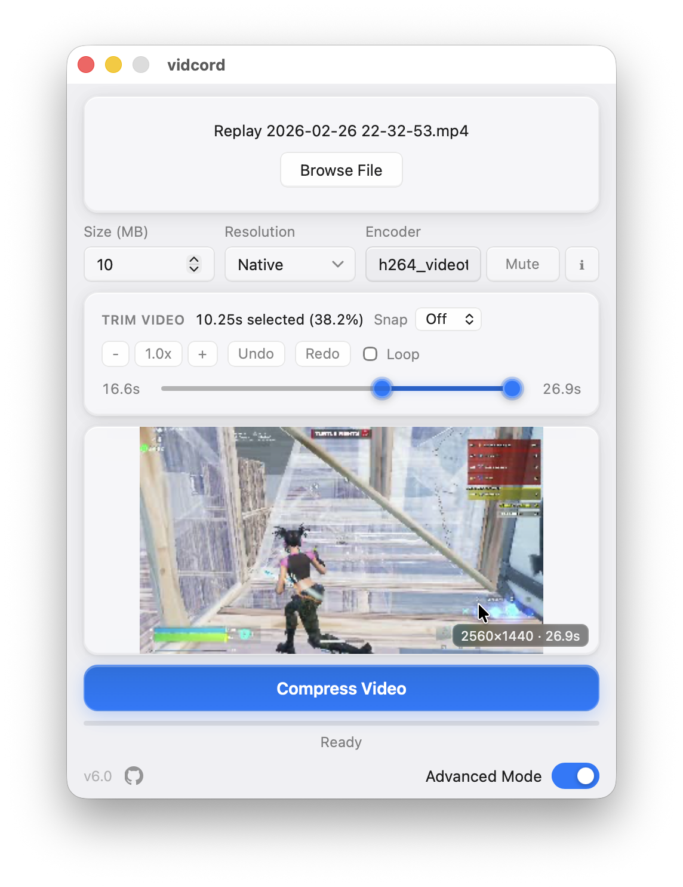
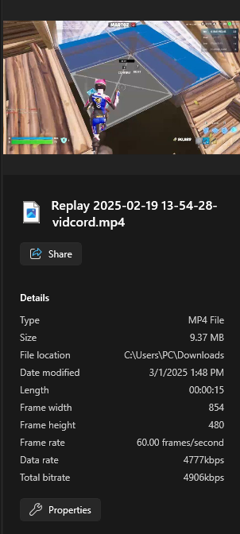

#  vidcord

A fast, lightweight desktop app for compressing video files under Discord's size limits — powered by FFmpeg, built with **Tauri** (Rust + React). Available for **Windows, macOS, and Linux**.

## Download

[Download latest release installer.](https://github.com/cyroz1/vidcord/releases/latest)

## Prerequisites

**FFmpeg must be installed on your system before running vidcord.** It is not bundled with the app.

**Windows (x86_64)**
```powershell
winget install Gyan.FFmpeg
```
Then restart your PC to apply the PATH change.

**Windows (ARM64 — Surface Pro X, Snapdragon PCs)**
No official ARM64 FFmpeg build exists yet. See [FFMPEG_SETUP.md](FFMPEG_SETUP.md) for manual install steps.

**macOS**
```sh
brew install ffmpeg
```

**Linux (Ubuntu/Debian)**
```sh
sudo apt install ffmpeg
```

For Fedora, Arch, and other distros, see [FFMPEG_SETUP.md](FFMPEG_SETUP.md).

## Features

- **Modern UI**: Clean, responsive interface styled after Fluent Design.
- **Three ways to import videos**:
  - **File Explorer / Finder**: Right-click a video → "Open with vidcord" (Windows, macOS).
  - **Drag and drop**: Drop a video file directly onto the window.
  - **Browse**: Click "Browse File" to pick a file.
- **Five quality presets**:
  - 10 MB, 480p — Discord free tier
  - 25 MB, 480p — Discord free tier (legacy)
  - 50 MB, 720p — Nitro Basic / Level 2 Server Boost
  - 100 MB, 1080p — Level 3 Server Boost or [Clips Bypass](https://github.com/riolubruh/YABDP4Nitro?tab=readme-ov-file#clips)
  - 500 MB, native — Nitro Full
- **Advanced Mode**: Custom target size (MB), resolution, and any FFmpeg encoder string.
- **Trim**: Adjustable start/end sliders with live frame preview.
- **Video playback preview**: Play the selected trim segment in-app before compressing.
- **Remove Audio**: Strip audio tracks to reclaim space.
- **Hardware acceleration**: NVIDIA (NVENC), AMD (AMF), Intel (QSV), Linux VAAPI, Apple Silicon (VideoToolbox) — auto-detected at startup.
- **Real-time progress**: Progress bar and ETA updated as FFmpeg runs.
- **Auto output**: Saves to your Downloads folder with an auto-incremented filename, then opens it in the file explorer.
- **Tiny binary**: ~10 MB installer (no bundled runtime — Tauri uses the system WebView).

## What's New in v6.0.0

vidcord has been fully rewritten from Python + PyQt6 to **Tauri (Rust + React)**. This is a ground-up rebuild — not an incremental update.

### Core changes

- **New runtime**: Replaced PyInstaller + Python with a native Tauri binary. No Python interpreter, no PyQt6, no bundled runtime.
- **Smaller installer**: ~10 MB vs ~80 MB — Tauri uses the OS WebView (Edge on Windows, WebKit on macOS/Linux) instead of bundling one.
- **Faster startup**: Near-instant launch; hardware detection and settings load happen in the background.
- **Rust backend**: All FFmpeg orchestration, file I/O, GPU detection, settings, and update checking are now in Rust.
- **React frontend**: UI rebuilt in React + TypeScript with a Fluent Design stylesheet.

### New features

- **Video playback preview**: Play the trimmed segment in-app before compressing (Windows + macOS; disabled on Linux due to WebKit limitations).
- **Linux VAAPI hardware acceleration**: Added `h264_vaapi` encoder support alongside NVIDIA, AMD, Intel, and Apple Silicon.
- **Apple Silicon VideoToolbox**: Native `h264_videotoolbox` encoder on M-series Macs.
- **ARM64 Windows support**: New aarch64 NSIS installer for Snapdragon PCs.
- **Single-instance enforcement**: Opening a second instance forwards the file to the existing window instead of launching a duplicate.
- **Settings persistence**: Remove Audio, advanced mode values, and encoder selection are saved across sessions.
- **Auto-increment output**: If the output filename already exists, vidcord appends `_1`, `_2`, etc. instead of overwriting.
- **Trim frame preview**: Live thumbnail updates as you drag the trim sliders.

### Platform fixes

- Windows: `CREATE_NO_WINDOW` on all FFmpeg calls (no console flash); fixed WebView2 `AbortError` on seek.
- macOS: Fixed "Open With" cold-launch race condition; Apple Events file delivery; universal binary (x86_64 + aarch64).
- Linux: Fixed GStreamer/GIO module errors in AppImage; KDE Plasma white window; LXQt/minimal WM compatibility; Wayland + X11 support.

### Removed

- Python source (`vidcord.py`), `requirements.txt`, PyInstaller specs, and all legacy build scripts.
- Old Linux platform scripts (`build_appimage.sh`, Debian/Fedora/Arch packaging).
- `changelog.md`, `verify_bitrate.py`, `tools/` debug scripts.

## Screenshots

### Program window


### Advanced mode



### Output file example



### Context menu integration


## Building

### Prerequisites

| Tool | Version | Notes |
|------|---------|-------|
| [Rust](https://rustup.rs) | stable | Install via `rustup` |
| [Node.js](https://nodejs.org) | 22.12+ | For the React frontend |
| [FFmpeg](https://ffmpeg.org/download.html) | any recent | Must be on `PATH` at runtime |
| **Linux only** | | `libwebkit2gtk-4.1-dev`, `libappindicator3-dev`, `librsvg2-dev`, `patchelf` |
| **Windows only** | | [WebView2](https://developer.microsoft.com/microsoft-edge/webview2/) (pre-installed on Win11) |

### Install FFmpeg

FFmpeg must be installed and available on your `PATH` before running or building vidcord.

**Windows**
```sh
winget install ffmpeg
```

**macOS**
```sh
brew install ffmpeg
```

**Linux (Debian/Ubuntu)**
```sh
sudo apt install ffmpeg
```

### Install and run (dev)

```sh
# Install frontend dependencies
npm install

# Start the dev server with hot-reload
npm run tauri dev
```

### Build a release binary

```sh
npm run tauri build
```

The installer or `.AppImage` will be in `src-tauri/target/release/bundle/`.

### CI / cross-platform releases

GitHub Actions builds on Windows (x86_64 + aarch64), macOS (universal), and Linux (x86_64 + aarch64) using a custom matrix that runs `npm run tauri build`. See [`.github/workflows/build.yml`](.github/workflows/build.yml).

## Acknowledgements

- [FFmpeg](https://ffmpeg.org/)
- [Tauri](https://tauri.app/)
- [React](https://react.dev/)
- [Vite](https://vitejs.dev/)
