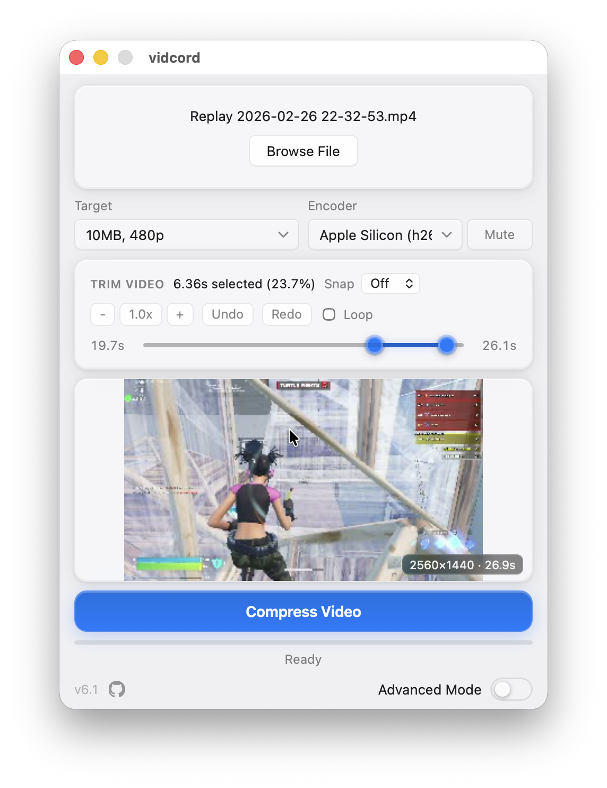
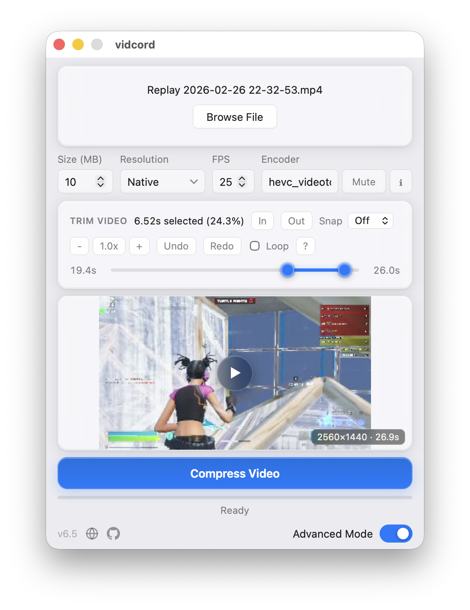
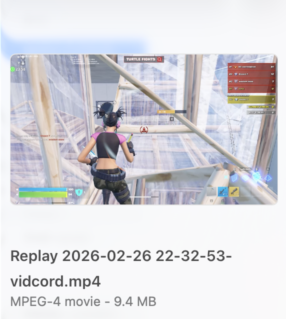
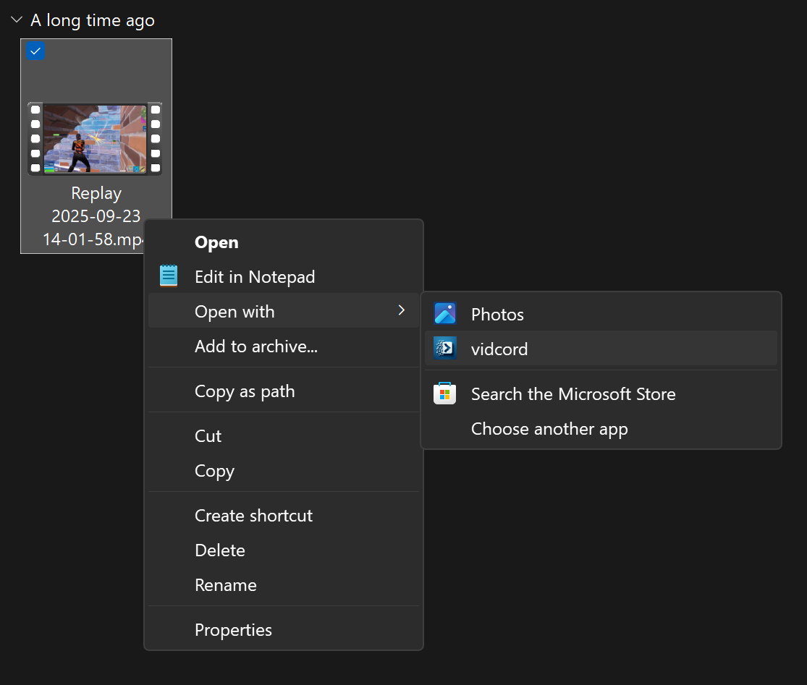

# vidcord - Free Discord Video Compressor for Windows, macOS, and Linux

<p>
  
</p>

**vidcord** is a free, open-source **Discord video compressor** for
**Windows, macOS, and Linux**. Compress videos for Discord's upload size
limits without uploading them to a website: choose a **10 MB, 25 MB, 50 MB,
100 MB, or 500 MB** target, trim the clip, and export a Discord-ready `.mp4`
from your desktop.

vidcord supports **MP4, MOV, MKV, AVI, WebM, FLV, WMV**, and other formats
handled by your system [FFmpeg](https://ffmpeg.org) install. It wraps FFmpeg
with hardware-accelerated encoding (NVIDIA NVENC, AMD AMF, Intel Quick Sync,
Linux VAAPI, Apple VideoToolbox), automatic bitrate calculation, strict output
size checks, output FPS controls, and a ~10 MB installer. Built with
[Tauri 2](https://tauri.app) (Rust + React). 100% local - no accounts,
no uploads, no telemetry.

<p>
  
  
  
  
  
  
  
</p>



> **At a glance** — Free Discord video compressor for Windows 10/11, macOS 11+,
> and Linux · x86_64 + aarch64 · ~10 MB installer · Compresses MP4, MOV, MKV,
> AVI, WebM, FLV, WMV to `.mp4` · Targets Discord's 10 / 25 / 50 / 100 /
> 500 MB limits · Hardware-accelerated (NVENC / AMF / QSV / VAAPI /
> VideoToolbox) · Requires system FFmpeg on `PATH` · MIT licensed ·
> Works fully offline.

---

## Contents

- [Why vidcord](#why-vidcord)
- [Best for](#best-for)
- [Features](#features)
- [Screenshots](#screenshots)
- [Download vidcord](#download-vidcord)
- [FFmpeg setup](#ffmpeg-setup)
- [Usage](#usage)
- [Keyboard shortcuts](#keyboard-shortcuts)
- [Hardware acceleration](#hardware-acceleration)
- [Building from source](#building-from-source)
- [Project layout](#project-layout)
- [Troubleshooting](#troubleshooting)
- [FAQ](#faq)
- [Contributing](#contributing)
- [License](#license)
- [Acknowledgements](#acknowledgements)

---

## Why vidcord

Discord caps uploads at 10 MB (free), 25 MB (legacy), 50 MB (Nitro Basic /
Boost Level 2), 100 MB (Boost Level 3), and 500 MB (Nitro). vidcord picks a
target bitrate for the clip length you want, lets you choose from the video
encoders exposed by your FFmpeg install, and drops the result in your
**Downloads** folder. It verifies the finished file against your selected size
limit and automatically retries with CPU encoding and safer bitrates when
FFmpeg's first pass lands too large.

- **~10 MB installer.** Tauri uses the system WebView (Edge on Windows,
  WebKit on macOS/Linux) instead of bundling Chromium.
- **Native-speed encoding.** Hardware encoders auto-detected: NVENC, AMF,
  QSV, VAAPI, VideoToolbox.
- **No telemetry, no accounts, no uploads.** Files never leave your machine.

## Best for

| Need | How vidcord helps |
|---|---|
| Compress a video for Discord free upload limits | Use the 10 MB preset, trim the clip, and remove audio if needed. |
| Compress large MP4, MOV, MKV, AVI, or WebM files | FFmpeg handles the input format and vidcord exports a Discord-friendly `.mp4`. |
| Make a video fit Discord Nitro or boosted server limits | Pick 50 MB, 100 MB, or 500 MB presets without calculating bitrates by hand. |
| Keep video compression private | Everything runs locally on your computer; no web upload step. |
| Use GPU video encoding from a simple GUI | vidcord auto-detects NVENC, AMF, QSV, VAAPI, and VideoToolbox encoders. |
| Cap output frame rate for smaller files | Leave FPS unchanged, or choose a lower output FPS when Discord size is tight. |

## Features

- **Five quality presets** mapped to Discord's tiers:
  - 10 MB @ 480p — Discord free tier
  - 25 MB @ 480p — Discord free tier (legacy)
  - 50 MB @ 720p — Nitro Basic / Boost Level 2
  - 100 MB @ 1080p — Boost Level 3 or
    [Clips Bypass](https://github.com/riolubruh/YABDP4Nitro?tab=readme-ov-file#clips)
  - 500 MB @ native — Nitro Full
- **Advanced mode** — custom target size (MB), output resolution, FPS, and any
  FFmpeg video encoder string, with autocomplete from the encoders your
  installed FFmpeg exposes.
- **Output FPS controls** — standard mode can leave FPS unchanged or cap it
  at 24, 30, or 60 FPS, hiding options above the source frame rate. Advanced
  mode accepts a custom FPS value, or an empty field shown as Off for no change.
- **Trim timeline** with frame-accurate handles, draggable playhead, snap
  controls, zoom, pan, undo/redo, and optional looped playback.
- **In-app preview** of the trimmed segment before you commit to a compress,
  starting from the current playhead when it is inside the selected range.
- **Responsive scrub previews** with display-sized filmstrip/frame thumbnails,
  sparse thumbnail generation for long videos, playhead-aware fallback preview clips,
  and hardware-accelerated preview clips where FFmpeg supports them.
- **Hardware acceleration**, auto-detected at startup:
  - NVIDIA NVENC (`h264_nvenc`, `hevc_nvenc`)
  - AMD AMF (`h264_amf`, `hevc_amf`)
  - Intel Quick Sync (`h264_qsv`, `hevc_qsv`)
  - Linux VAAPI (`h264_vaapi`, `hevc_vaapi`)
  - Apple Silicon VideoToolbox (`h264_videotoolbox`, `hevc_videotoolbox`)
- **Three ways to open a video:** drag-and-drop onto the window, "Open with
  vidcord" from Explorer/Finder, or the in-app **Browse** button.
- **Compact fixed-width window** — starts at 460×690, keeps a fixed 460 px
  width, and automatically adjusts height to fit content and monitor space.
- **Remove audio** — strip the audio track to reclaim space.
- **Strict size checks** — finished files are measured against the selected
  target; oversized results are retried with `libx264` and lower safety
  bitrates before reporting the smallest result.
- **Real-time progress** with ETA, current attempt number, encoder, and
  bitrate parsed from FFmpeg's stderr.
- **Auto-increment output** — saves `name-vidcord.mp4` and bumps `-1`, `-2`,
  … if the filename is taken, never overwriting.
- **Automated FFmpeg setup assistance** — Windows installers offer `winget`,
  and first launch prompts to install through the platform package manager.
  No FFmpeg binaries are bundled with vidcord.
- **Cross-platform installers:** Windows NSIS (x86_64 + aarch64), macOS
  universal `.dmg`, Linux `.AppImage` (x86_64 + aarch64).

### Supported input formats

MP4, MOV, MKV, AVI, WebM, FLV, WMV, and any other container / codec
combination your system FFmpeg can demux. Output is always `.mp4` — H.264
(AVC) by default, H.265 (HEVC) if you pick an `hevc_*` encoder in Advanced
mode.

## Screenshots

| Main window | Advanced mode |
|---|---|
|  |  |

| Output file | Windows context menu | macOS Finder |
|---|---|---|
|  |  |  |

## Download vidcord

Grab the latest installer for your platform from the releases page:

**→ [Download latest release](https://github.com/cyroz1/vidcord/releases/latest)**

| Platform | Architecture | File |
|---|---|---|
| Windows 10/11 | x86_64 | `vidcord_<version>_x64-setup.exe` |
| Windows 10/11 | aarch64 | `vidcord_<version>_arm64-setup.exe` |
| macOS 11+ | universal | `vidcord_<version>_universal.dmg` |
| Linux (any distro with glibc) | x86_64 | `vidcord_<version>_amd64.AppImage` |
| Linux (any distro with glibc) | aarch64 | `vidcord_<version>_aarch64.AppImage` |

> **You still need FFmpeg.** vidcord does not bundle FFmpeg. See the next
> section. The installer or first launch can offer to install it for you.

## FFmpeg setup

vidcord shells out to the system `ffmpeg` and `ffprobe` binaries, which must
be on `PATH`. If they aren't, vidcord can prompt on first launch and attempt a
package-manager install: `winget` on Windows, `brew` on macOS, or apt/dnf/pacman
on Linux with privilege confirmation.

### Windows

```powershell
winget install Gyan.FFmpeg
```

The vidcord installer and first-launch setup can run this for you when FFmpeg is
missing. Restart vidcord (or sign out and back in) so the new `PATH` takes
effect.

### Windows (aarch64 — Surface Pro X, Snapdragon PCs)

vidcord tries the same `winget` setup first. If the package is unavailable for
your ARM64 PC, see [FFMPEG_SETUP.md](FFMPEG_SETUP.md) for the community build
and manual PATH steps.

### macOS

```sh
brew install ffmpeg
```

### Linux

```sh
sudo apt install ffmpeg        # Debian / Ubuntu
sudo dnf install ffmpeg        # Fedora (needs RPM Fusion)
sudo pacman -S ffmpeg          # Arch / Manjaro
```

For more distros, manual installs, or troubleshooting, read
[FFMPEG_SETUP.md](FFMPEG_SETUP.md).

## Usage

1. **Open a video** — drop it onto the window, right-click → *Open with
   vidcord* from Explorer/Finder, or click **Browse File**.
2. **Pick a preset** — 10/25/50/100/500 MB, or flip on **Advanced mode** for
   a custom target size, resolution, FPS, and encoder. Standard mode can
   also cap output FPS at 24, 30, or 60 when those values do not exceed the
   source frame rate.
3. **Trim** (optional) — drag the handles or use `I` / `O` to stamp the
   playhead. `Space` plays the selected range from the current playhead when it
   is inside the trim.
4. **Toggle Remove Audio** to strip audio if you need more video bitrate.
5. **Click Compress.** Progress shows the current attempt, encoder, bitrate,
   and ETA. When it's done, vidcord reports the final output size and
   highlights the file in your file explorer.

Output goes to `~/Downloads/<original-name>-vidcord.mp4` by default, with
`-1`, `-2`, … appended if the name is taken.

## Keyboard shortcuts

| Key | Action |
|-----|--------|
| `Space` | Play / stop preview from the playhead |
| `,` / `.` | Step one frame back / forward |
| `Shift` + `←` / `→` | Nudge active trim handle by a small step |
| `J` / `K` | Jump playhead to trim start / end |
| `[` / `]` | Nudge trim start / end by a small step |
| `I` / `O` | Set trim in / out to current playhead |
| `R` / `U` | Reset trim to full clip |
| `Cmd/Ctrl` + `Z` | Undo trim |
| `Cmd/Ctrl` + `Shift` + `Z` | Redo trim |

## Hardware acceleration

At startup vidcord runs `ffmpeg -encoders`, detects compatible CPU and hardware
encoders, and lets you choose the encoder to use. Advanced mode can accept any
FFmpeg video encoder string; the **Encoders** dialog shows what your installed
FFmpeg exposes.

| Vendor / Platform | Encoder | Notes |
|---|---|---|
| NVIDIA | `h264_nvenc`, `hevc_nvenc` | Maxwell 2nd-gen and newer |
| AMD | `h264_amf`, `hevc_amf` | Windows only; Linux uses VAAPI |
| Intel | `h264_qsv`, `hevc_qsv` | HD Graphics 500-series and newer |
| Linux (any GPU) | `h264_vaapi`, `hevc_vaapi` | Requires a working `/dev/dri/renderD*` |
| Apple Silicon | `h264_videotoolbox`, `hevc_videotoolbox` | Native on M-series Macs |
| Fallback (CPU) | `libx264`, `libx265` | Always available |

On Linux, vidcord probes `/dev/dri/renderD*` once per session to pick the
right VAAPI device, and sets `LIBVA_DRIVER_NAME=radeonsi` for AMD systems.

## Building from source

### Prerequisites

| Tool | Version | Notes |
|---|---|---|
| [Rust](https://rustup.rs) | stable (2021 edition) | `rustup default stable` |
| [Node.js](https://nodejs.org) | `^20.19` or `>=22.12` | see `package.json` engines |
| [FFmpeg](https://ffmpeg.org/download.html) | any recent | must be on `PATH` at runtime |
| **Linux extras** | — | `libwebkit2gtk-4.1-dev`, `libappindicator3-dev`, `librsvg2-dev`, `patchelf` |
| **Windows extras** | — | [WebView2 Runtime](https://developer.microsoft.com/microsoft-edge/webview2/) (pre-installed on Windows 11) |

### Run the dev build

```sh
git clone https://github.com/cyroz1/vidcord
cd vidcord
npm install
npm run tauri dev
```

Vite serves the frontend on `:5173` and Tauri launches the window with
hot-reload.

### Produce a release binary

```sh
npm run tauri build
```

Installers / bundles land in `src-tauri/target/release/bundle/`.

### Quality gates

```sh
npm run lint                                            # eslint src
npm run typecheck                                       # tsc --noEmit
npm test                                                # vitest
npm run format                                          # prettier --write src
cargo fmt   --check --manifest-path src-tauri/Cargo.toml
cargo clippy --manifest-path src-tauri/Cargo.toml --tests -- -D warnings
cargo test  --manifest-path src-tauri/Cargo.toml
(cd src-tauri && cargo audit)                           # respects .cargo/audit.toml
```

CI treats any clippy warning as an error and also runs npm/Rust audit, version,
asset, lint, typecheck, test, and build checks. Keep new Rust code
warning-clean.

### Build profiles

- `release` — LTO, `codegen-units = 1`, `strip`, `panic = abort`. Used for
  tagged `v*` releases.
- `ci` — inherits `release` with `lto = false`, `codegen-units = 4`,
  `opt-level = 1`. Used by non-tag CI builds for speed.
- `dev.package."*"` — third-party deps built at `opt-level = 1` so FFmpeg
  stderr parsing and regex stay responsive in `tauri dev` while our own
  crate stays unoptimised for fast incremental compiles.

### CI / releases

[`.github/workflows/build.yml`](.github/workflows/build.yml) runs five jobs:
a shared frontend build, Rust lint + audit, clippy + tests, a 5-way bundle
matrix (Windows x86_64/aarch64, macOS universal, Linux x86_64/aarch64), and
a release job that extracts the matching `CHANGELOG.md` section and drafts
a GitHub release on `v*` tags.

## Project layout

```
src/                       React + TypeScript frontend
  App.tsx                  Root component — trim UI, preset wiring, compress flow
  ipc.ts                   Typed wrappers around Tauri invoke() commands
  components/              PreviewPane, TrimTimeline, ProgressSection, Toast, EncodersDialog
  hooks/                   useCompression, useEncoders, useSettings, useToasts
  __tests__/               Vitest tests (node env, Tauri APIs mocked)

src-tauri/                 Rust backend
  src/lib.rs               Tauri builder, plugins, Linux env shims, file-open routing
  src/ffmpeg.rs            Probe / preview / filmstrip / VAAPI discovery + caches
  src/ffmpeg/encoders.rs   FFmpeg encoder detection + encoder cache invalidation
  src/gpu.rs               Vendor detection (lspci / system_profiler / CIM)
  src/settings.rs          Typed settings persisted via atomic rename
  src/commands/            #[tauri::command] handlers (compression, encoders, files, updates)
  tauri.conf.json          Product config, CSP, file associations, bundle targets

.github/workflows/         App build/release workflow plus site validation workflow
scripts/                   Version, asset, and site structured-data checks
```

A deeper architectural tour — IPC boundary, file-open race conditions,
cache layout, settings migration — lives in [AGENTS.md](AGENTS.md).

## Troubleshooting

**"FFmpeg not found" after installing it.**
`PATH` changes don't propagate to running processes. Quit vidcord fully
(check the tray / dock) and relaunch. On Windows, sign out and back in if
that doesn't help.

**The output file exceeds the target size.**
vidcord now retries oversized outputs automatically, first with CPU encoding
and then with lower safety bitrates. If it still cannot hit the requested
limit, the status line reports the smallest oversized result. Try **Remove
audio**, drop to a lower resolution in Advanced mode, or pick `hevc_*`
(H.265) if your recipient can decode it.

**Preview is blank on Linux.**
WebKit2GTK's `<video>` element has spotty codec coverage. Install
`gstreamer1.0-libav` and `gstreamer1.0-plugins-bad` (Debian/Ubuntu naming)
and relaunch.

**Windows console flashes during a compress.**
Shouldn't happen — every FFmpeg invocation sets `CREATE_NO_WINDOW`
(`0x08000000`). If you see it, open an issue with the vidcord log
(`%LOCALAPPDATA%\vidcord\vidcord.log`).

**Where do settings live?**

| OS | Path |
|---|---|
| Windows | `%LOCALAPPDATA%\vidcord\settings.json` |
| macOS | `~/Library/Application Support/vidcord/settings.json` |
| Linux | `~/.local/share/vidcord/settings.json` |

Logs live alongside `settings.json` as `vidcord.log` (rotated at 5 MB).

## FAQ

### What is the best free Discord video compressor?

vidcord is built specifically for Discord uploads. It offers one-click
presets for Discord's 10 MB, 25 MB, 50 MB, 100 MB, and 500 MB limits, runs
locally on Windows, macOS, and Linux, and uses FFmpeg instead of uploading
your video to a third-party compression website.

### How do I compress a video for Discord under 10 MB?

Open the video in vidcord, choose the **10 MB** preset, trim to the part you
want to share, optionally enable **Remove Audio**, and click **Compress**.
vidcord calculates the target bitrate from the clip length, verifies the
finished file size, and retries with safer settings if the output is too
large.

### Is vidcord free and open-source?

Yes. vidcord is released under the [MIT License](LICENSE) with the full
source on GitHub. There are no paid tiers, accounts, or trials.

### Does vidcord upload my videos anywhere?

No. vidcord runs entirely on your computer — no server, no account,
no telemetry. The only network call is an optional background check
against the GitHub Releases API for new versions, which you can disable
in settings.

### What are Discord's video upload size limits?

- **Free accounts:** 10 MB per file (was 8 MB before late 2022; 25 MB
  is a legacy value still applied to some accounts).
- **Server Boost Level 2 / Nitro Basic uploads:** 50 MB.
- **Server Boost Level 3 uploads:** 100 MB (also the ceiling for the
  [Clips Bypass](https://github.com/riolubruh/YABDP4Nitro?tab=readme-ov-file#clips)
  trick).
- **Nitro Full:** 500 MB per file.

vidcord ships one preset per tier and picks a resolution cap that usually
still looks reasonable at that bitrate.

### Which video formats does vidcord support?

Any container your system FFmpeg can demux: **MP4, MOV, MKV, AVI, WebM,
FLV, WMV**, and more. Output is always `.mp4` (H.264 by default, H.265
if you pick an `hevc_*` encoder in Advanced mode).

### Can vidcord compress MP4 files for Discord?

Yes. MP4 is the main output format and one of the common supported input
formats. You can open an existing `.mp4`, trim it, choose a Discord size
limit, and export a smaller `.mp4` ready to upload.

### Does vidcord require Discord Nitro?

No. The 10 MB and 25 MB presets target free Discord accounts
specifically; the 50 / 100 / 500 MB presets are there for boosted
servers and Nitro subscribers.

### Can I change the output FPS?

Yes. Standard mode offers Off, 24, 30, and 60 FPS, and hides choices above
the source video's frame rate. Advanced mode lets you enter any positive FPS
value, or leave the Off field empty to keep the original cadence.

### How is vidcord different from using FFmpeg directly?

vidcord calculates the right target bitrate for your clip length and
size limit, picks the best hardware encoder for your GPU, streams attempt
details and ETA back while FFmpeg runs, verifies the final file size, retries
oversized results, handles visual trimming, and writes to a predictable,
auto-incremented path in your Downloads folder.
Under the hood it's still FFmpeg — Advanced mode exposes the encoder
string so you can override any of it.

### Can vidcord compress a video without re-encoding?

Not currently. Hitting a specific target size under Discord's limits
requires re-encoding at a calculated bitrate; stream-copy wouldn't
guarantee the output fits.

### Does vidcord work on Linux and Wayland?

Yes. vidcord ships as an `.AppImage` for x86_64 and aarch64 and is
tested on GNOME, KDE Plasma, LXQt, Sway, and Hyprland on both X11 and
Wayland. Hardware-accelerated encoding uses VAAPI via `/dev/dri/renderD*`.

### Is there a CLI version?

No — vidcord is a GUI app. For scripted workflows, call FFmpeg directly;
the presets in vidcord are just wrappers around standard FFmpeg arguments.

### Does vidcord work offline?

Yes. Once vidcord and FFmpeg are installed, no internet connection is
needed to compress a video.

### What are the system requirements?

- Windows 10 or 11 (x86_64 or aarch64) with the WebView2 Runtime
  (pre-installed on Windows 11).
- macOS 11 (Big Sur) or newer, Intel or Apple Silicon.
- Linux with `glibc` and WebKit2GTK 4.1 (almost every modern desktop
  distribution).
- ~50 MB disk for the app, plus whatever FFmpeg needs (~100 MB).

## Contributing

Issues and PRs are welcome. Before opening a PR:

1. Run all quality gates above — CI is strict about clippy and formatting.
2. Add a `## vX.Y` section at the top of [CHANGELOG.md](CHANGELOG.md) for
   user-visible changes. The release workflow uses it as the GitHub release
   body.
3. **Don't bump version numbers casually.** `package.json`,
   `src-tauri/Cargo.toml`, and `src-tauri/tauri.conf.json` must stay in
   sync, and any bump triggers a release the next time a tag is pushed.

Read [AGENTS.md](AGENTS.md) for the architectural invariants you're
expected not to break (Tauri command registration, blocking work and
`spawn_blocking`, the three file-open delivery paths, Linux env shims for
KDE / LXQt / Sway / Hyprland, cache invalidation rules).

## License

vidcord is released under the [MIT License](LICENSE). FFmpeg is a separate
dependency and is licensed under the LGPL/GPL by its own authors — vidcord
invokes the `ffmpeg` and `ffprobe` binaries on your system but does not
redistribute them.

## Acknowledgements

- [FFmpeg](https://ffmpeg.org/) — the actual video compression.
- [Tauri](https://tauri.app/) — cross-platform desktop shell.
- [React](https://react.dev/) + [Vite](https://vitejs.dev/) — frontend.
- [YABDP4Nitro](https://github.com/riolubruh/YABDP4Nitro) — documented the
  Discord Clips size-limit quirk that the 100 MB preset targets.

---

<sub>
Keywords: Discord video compressor, compress video for Discord, Discord
10 MB limit, Discord 25 MB limit, Discord 50 MB upload, Discord 100 MB
upload, Discord 500 MB Nitro, shrink MP4 for Discord, FFmpeg GUI,
FFmpeg frontend, cross-platform video compressor, Windows video
compressor, macOS video compressor, Linux video compressor, open-source
video compressor, free video compressor.
</sub>
