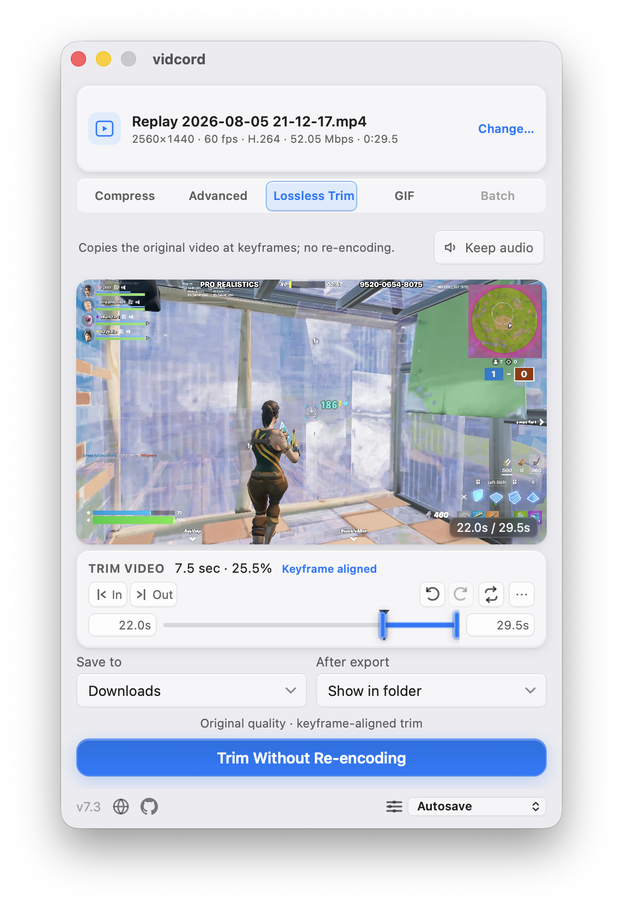
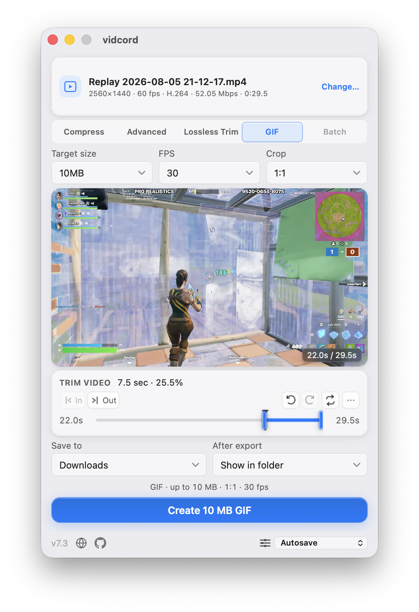

# vidcord - Free Discord Video Compressor for Windows, macOS, and Linux

<p>
  
</p>

**vidcord** is a free, open-source **Discord video compressor** for
**Windows, macOS, and Linux**. Compress videos for Discord's upload size
limits without uploading them to a website: choose a **10 MB, 25 MB, 50 MB,
100 MB, or 500 MB** target, trim the clip, or choose **Lossless Trim** to cut
on source keyframes without re-encoding. Export a Discord-ready video from
your desktop. GIF Mode creates animated `.gif` exports for Discord's
**10 MB Free** and **50 MB Nitro Basic** tiers.

Select multiple videos through Browse, drag-and-drop, Open With, command-line
file arguments, or a second app instance to enter **Batch mode** automatically.
Batch mode probes each file, applies the same standard Compress settings to
every video, and produces collision-safe MP4 outputs while keeping processing
local.

vidcord supports **MP4, MOV, MKV, AVI, WebM, FLV, WMV**, and other formats
handled by your system [FFmpeg](https://ffmpeg.org) install. It wraps FFmpeg
with hardware-accelerated encoding (NVIDIA NVENC, AMD AMF, Intel Quick Sync,
Linux VAAPI, Apple VideoToolbox), automatic bitrate calculation, strict output
size checks, output FPS controls, and platform-native installers. Built with
[Tauri 2](https://tauri.app) (Rust + React). 100% local - no accounts,
no uploads, no telemetry.

<p>
  
  
  
  
  
  
</p>


> **At a glance** — Free Discord video compressor for Windows 10/11, macOS 11+,
> and Linux · x86_64 + aarch64 · Platform-native installers · Compresses MP4, MOV, MKV,
> AVI, WebM, FLV, WMV to `.mp4` · Targets Discord's current 10 / 50 / 100 /
> 500 MB limits plus a legacy 25 MB size · Hardware-accelerated (NVENC / AMF / QSV / VAAPI /
> VideoToolbox) · Requires system FFmpeg on `PATH` · MIT licensed ·
> Works fully offline.

---

## Contents

- [Why vidcord](#why-vidcord)
- [Best for](#best-for)
- [Features](#features)
- [Screenshots](#screenshots)
- [Download vidcord](#download-vidcord)
- [FFmpeg setup](#ffmpeg-setup)
- [Usage](#usage)
- [Keyboard shortcuts](#keyboard-shortcuts)
- [Hardware acceleration](#hardware-acceleration)
- [Building from source](#building-from-source)
- [Project layout](#project-layout)
- [Troubleshooting](#troubleshooting)
- [FAQ](#faq)
- [Contributors](#contributors)
- [Contributing](#contributing)
- [License](#license)
- [Acknowledgements](#acknowledgements)

---

## Why vidcord

Discord's current upload limits are 10 MB (free), 50 MB (Nitro Basic /
Boost Level 2), 100 MB (Boost Level 3), and 500 MB (Nitro). vidcord also keeps
a legacy 25 MB target for users who still want that size. It picks a
target bitrate for the clip length you want, lets you choose from the video
encoders exposed by your FFmpeg install, and drops the result in your
**Downloads** folder by default. You can instead save beside the imported clip,
choose a persistent custom folder, or have vidcord ask for a location when the
encode finishes. By default, the completed file itself is copied to the system
clipboard; if that fails, vidcord reveals it in the platform file manager. It
can also be set to always reveal the output. It verifies the finished file against your selected size limit,
applies an encoder-specific peak-rate bound, and automatically retries with CPU
encoding and safer bitrates when FFmpeg's first pass lands too large.

- **Platform-native packaging.** Tauri uses the system WebView (Edge on Windows,
  WebKit on macOS/Linux) instead of bundling Chromium. Package size varies by
  platform: Windows installers are the smallest, macOS ships a universal DMG,
  and the self-contained Linux AppImages are substantially larger.
- **Native-speed encoding.** Hardware encoders auto-detected: NVENC, AMF,
  QSV, VAAPI, VideoToolbox.
- **No telemetry, no accounts, no uploads.** Files never leave your machine.

## Best for

| Need                                                    | How vidcord helps                                                              |
| ------------------------------------------------------- | ------------------------------------------------------------------------------ |
| Compress a video for Discord free upload limits         | Use the 10 MB preset, trim the clip, and remove audio if needed.               |
| Compress large MP4, MOV, MKV, AVI, or WebM files        | FFmpeg handles the input format and vidcord exports a Discord-friendly `.mp4`. |
| Compress several videos in one pass                       | Batch mode applies shared Compress settings, runs up to two encodes in parallel, and keeps going after individual failures. |
| Preserve original video quality while trimming          | Use Lossless Trim for keyframe-aligned stream-copy output without re-encoding. |
| Turn a video clip into a Discord GIF                    | Enable GIF Mode and choose the 10 MB Free or 50 MB Nitro Basic target.         |
| Make a video fit Discord Nitro or boosted server limits | Pick 50 MB, 100 MB, or 500 MB presets without calculating bitrates by hand.    |
| Keep video compression private                          | Everything runs locally on your computer; no web upload step.                  |
| Use GPU video encoding from a simple GUI                | vidcord auto-detects NVENC, AMF, QSV, VAAPI, and VideoToolbox encoders.        |
| Cap output frame rate for smaller files                 | Leave FPS unchanged, or choose a lower output FPS when Discord size is tight.  |

## Features

- **Saved settings presets** — the app autosaves the last settings used by default;
  use the bottom-right preset dropdown to save, restore, and delete up to 20 named compression and
  mode configurations. Names are limited to 40 characters; changing a saved preset's settings
  returns the selector to Autosave, while output destination and completion action remain separate
  autosaved preferences.

- **Automatic Batch mode** — selecting two or more videos switches from the single-video
  workflows automatically. The queue probes and shows each file's resolution, frame rate, codec,
  bitrate, and duration, with per-file queued, encoding, completed, failed, or cancelled states.
  Batch uses standard Compress controls only, always writes MP4 output, and provides separate
  start-trim and end-trim seconds that default to `0`. Remove queued items before export; when a
  trim would leave less than one second, the two trim values are reduced proportionally.
- **Parallel batch encoding** — up to two videos encode concurrently by default. If the selected
  encoder reports a device, session, or resource-contention error, remaining work continues one
  video at a time. Individual probe or encode failures do not stop the queue, and aggregate
  progress and ETA cover the whole remaining batch rather than only the currently active item.
- **Five quality presets** covering current Discord tiers plus a legacy target:
  - 10 MB @ 480p — Discord free tier
  - 25 MB @ 480p — legacy convenience target (not a current Discord tier)
  - 50 MB @ 720p — Nitro Basic / Boost Level 2
  - 100 MB @ 1080p — Boost Level 3 or
    [Clips Bypass](https://github.com/riolubruh/YABDP4Nitro?tab=readme-ov-file#clips)
  - 500 MB @ native — Nitro Full
- **GIF Mode** — export an optimized animated GIF for the 10 MB Discord Free
  or 50 MB Nitro Basic tier at 15, 30, or Discord-safe maximum 50 FPS. Video-only encoder, audio,
  and unrelated video controls are hidden while GIF Mode is active; the aspect-ratio crop selector
  remains available because it still applies to GIF output. Higher frame rates trade spatial detail
  for motion, and oversized GIFs are retried at
  progressively lower visual complexity without changing the selected FPS.
- **Advanced mode** — custom target size (MB), output resolution, FPS, audio
  normalization, and any FFmpeg video encoder string, with
  autocomplete from the encoders your installed FFmpeg exposes. Its per-video
  audio mixer lists every source track by name and estimated size, defaults to
  the first track unless another is at least 20% larger by estimated data, and can select any combination without changing saved
  settings or presets. Leave target size empty to encode at the source bitrate
  without a file-size limit.
- **Aspect-ratio cropping** — available in Compress, Advanced, and GIF Mode;
  crop to 16:9, 1:1, 9:16, 4:3, 3:4, 4:5, or 5:4 before scaling. A preset
  matching the imported video's native display ratio is hidden automatically.
- **Smart audio output** — optionally peak-normalize retained audio so its highest sample
  peak reaches `0 dB` with a fixed gain. Standard compression starts with the first
  source track and switches to the largest estimated-data track only when it is at
  least 20% larger. Advanced mode can select one, several, or all source tracks;
  each selected track is encoded at 128 kbps and the video bitrate budget
  accounts for every selected track.
- **Full-resolution frame snapshots** — save the frame at the playhead as a
  PNG with the preview overlay or `Cmd+Shift+S` / `Ctrl+Shift+S`. Snapshots
  follow the configured output destination and copy/reveal completion action.
- **Output FPS controls** — standard mode can leave FPS unchanged or cap it
  at 24, 30, or 60 FPS, hiding options at or above the source frame rate when
  they would be redundant. Advanced mode accepts a custom FPS value, or an
  empty field shown as Off for no change.
- **Completion actions** — copy the finished output file itself to the system
  clipboard by default, with an automatic reveal fallback, or always reveal it
  in Explorer/Finder instead.
- **Trim timeline** with fine-grained handles, draggable playhead, snap
  controls, zoom, pan, undo/redo, and optional looped playback.
- **Lossless Trim** — use the dedicated copy-mode tab beside Advanced to
  preserve every source stream with a fast keyframe-aligned stream copy, or
  remove all audio tracks without re-encoding the video. Unrelated settings are
  hidden while the mode is active. When a selected segment is estimated to fit
  a chosen size target at the source bitrate, pressing Compress offers this
  mode automatically; accepting it switches to less-precise keyframe trimming
  so you can choose the trim points again before exporting. Boundaries snap
  outward to source keyframes; vidcord prefers an MP4 stream-copy output, then
  the validated source container, and falls back to normal compression when
  neither is compatible.
- **In-app playback preview** of the trimmed segment in single-video mode on Windows and macOS,
  starting from the current playhead when it is inside the selected range.
- **Responsive single-video scrub previews** with display-sized filmstrip/frame thumbnails,
  sparse thumbnail generation for long videos, playhead-aware fallback preview clips,
  and hardware-accelerated preview clips where FFmpeg supports them.
- **Efficient preview fallback** — exact frame requests use display-sized, bounded
  in-memory output; cancelling a stale frame no longer interrupts a filmstrip that
  is already being generated, and generated fallback clips omit unused audio.
- **Linux preview fallback** — WebKitGTK live video scrubbing and trim playback are
  disabled for stability; FFmpeg-generated filmstrip and individual-frame previews
  remain available while scrubbing.
- **Hardware acceleration**, auto-detected at startup:
  - NVIDIA NVENC (`h264_nvenc`, `hevc_nvenc`)
  - AMD AMF (`h264_amf`, `hevc_amf`)
  - Intel Quick Sync (`h264_qsv`, `hevc_qsv`)
  - Linux VAAPI (`h264_vaapi`, `hevc_vaapi`)
  - macOS VideoToolbox (`h264_videotoolbox`, `hevc_videotoolbox`)
- **Multiple ways to open videos:** drag-and-drop onto the window, "Open with
  vidcord" from Explorer/Finder, command-line file arguments, a second-instance
  launch, or the in-app **Browse** button. Selecting one video preserves the
  normal workflow; selecting multiple videos activates Batch mode.
- **Source details at import** — see resolution, frame rate, codec, average
  bitrate, and duration in a compact summary. Batch mode shows those details
  for every queued video.
- **Compact fixed-size window** — stays fixed at 460×690, with standard and
  advanced controls fitted into the app surface; long Batch queues use an
  internal scrollbar rather than expanding the window.
- **System-matched macOS chrome** — the native title bar follows macOS Light
  and Dark appearances together with the app surface.
- **Remove audio** — strip the audio track to reclaim space.
- **Strict size checks with bounded retries** — finished files are measured
  against the selected target. Target-size encodes apply encoder-specific
  peak-rate bounds before adaptive correction. Hardware jobs use at most four
  full attempts and CPU jobs use at most two, including measured bitrate
  correction and CPU fallback before reporting the smallest result.
- **Real-time progress** with ETA, current attempt number, encoder, and
  bitrate parsed from FFmpeg's stderr. Batch progress is aggregated across all
  items and its ETA estimates the remaining queue.
- **OS taskbar & dock progress integration** — reflects encoding progress directly on your OS taskbar or dock icon (macOS Dock, Windows Taskbar button, Linux Unity launcher bar) so you can track encoding while unfocused.
- **Native system notifications** — mirrors every in-app banner and error in order as
  a matching OS notification while vidcord is unfocused on Windows, macOS, and Linux;
  clicking a notification restores and focuses the app.
- **Race-safe cancellation** — cancelling keeps the job owned until FFmpeg
  exits, prevents another encode from starting early, removes partial output,
  terminates active batch children, and skips queued batch items.
- **Collision-safe auto-named output** — direct destination modes atomically
  reserve `name-vidcord.mp4` before encoding and bump `-1`, `-2`, … if needed,
  even if another file appears at the intended path just before compression starts.
  Batch allocation reserves one unique MP4 path per input.
- **Flexible output location** — save to Downloads, beside the imported clip,
  to a remembered custom folder, or choose a filename after compression finishes.
  For a batch using Ask when done, successful outputs are staged until one
  destination folder is chosen and then published together.
- **Verified in-app updates** — update checks run after startup settles and no
  more than once every six hours. After approval, vidcord streams the matching
  installer to Downloads, validates its size and completeness, compares the
  downloaded bytes with GitHub's published SHA-256 digest, verifies the
  independent Ed25519 release signature, chooses an unused filename, and opens
  it.
- **Automated FFmpeg setup assistance** — Windows installers offer `winget`,
  and first launch prompts to install through the platform package manager.
  No FFmpeg binaries are bundled with vidcord.
- **Cross-platform installers:** Windows NSIS (x86_64 + aarch64), macOS
  universal `.dmg`, Linux `.AppImage` (x86_64 + aarch64).

### Supported input formats

MP4, MOV, MKV, AVI, WebM, FLV, WMV, and any other container / codec
combination your system FFmpeg can demux. Standard and Advanced mode output is
`.mp4` — H.264 (AVC) by default or H.265 (HEVC) if you pick an `hevc_*`
encoder. Lossless Trim prefers `.mp4` and can use the validated source video
extension when the source container is the compatible stream-copy choice. GIF
Mode creates an animated `.gif`.

## Screenshots

| Compress mode                                                                                                  | Advanced mode                                                                                                              | Lossless Trim                                                                                                            | GIF mode                                                                                                                | Batch mode                                                                                                  |
| -------------------------------------------------------------------------------------------------------------- | -------------------------------------------------------------------------------------------------------------------------- | ------------------------------------------------------------------------------------------------------------------------ | ----------------------------------------------------------------------------------------------------------------------- | ----------------------------------------------------------------------------------------------------------- |
|  |  |  |  |  |

| Output file                                                                                 | Windows context menu                                                                                            | macOS Finder                                                                                          |
| ------------------------------------------------------------------------------------------- | --------------------------------------------------------------------------------------------------------------- | ----------------------------------------------------------------------------------------------------- |
|  |  |  |

## Download vidcord

Grab the latest installer for your platform from the releases page:

**→ [Download latest release](https://github.com/cyroz1/vidcord/releases/latest)**

| Platform                            | Architecture | File                                 |
| ----------------------------------- | ------------ | ------------------------------------ |
| Windows 10/11                       | x86_64       | `vidcord_<version>_x64-setup.exe`    |
| Windows 10/11                       | aarch64      | `vidcord_<version>_arm64-setup.exe`  |
| macOS 11+                           | universal    | `vidcord_<version>_universal.dmg`    |
| Linux (modern glibc desktop distro) | x86_64       | `vidcord_<version>_amd64.AppImage`   |
| Linux (modern glibc desktop distro) | aarch64      | `vidcord_<version>_aarch64.AppImage` |

> **You still need FFmpeg.** vidcord does not bundle FFmpeg. See the next
> section. The installer or first launch can offer to install it for you.

## FFmpeg setup

vidcord shells out to the system `ffmpeg` and `ffprobe` binaries, which must
be on `PATH`. If they aren't, vidcord can prompt on first launch and attempt a
package-manager install: `winget` on Windows, `brew` on macOS, or apt/dnf/pacman
on Linux with privilege confirmation.

### Windows

```powershell
winget install Gyan.FFmpeg
```

The vidcord installer and first-launch setup can run this for you when FFmpeg is
missing. vidcord recognizes WinGet's FFmpeg install directory immediately, even
when the running process has not received the updated `PATH`.

### Windows (aarch64 — Surface Pro X, Snapdragon PCs)

vidcord tries the same `winget` setup first. If the package is unavailable for
your ARM64 PC, see [FFMPEG_SETUP.md](FFMPEG_SETUP.md) for the community build
and manual PATH steps.

### macOS

```sh
brew install ffmpeg
```

### Linux

```sh
sudo apt install ffmpeg        # Debian / Ubuntu
sudo dnf install ffmpeg        # Fedora (needs RPM Fusion)
sudo pacman -S ffmpeg          # Arch / Manjaro
```

For more distros, manual installs, or troubleshooting, read
[FFMPEG_SETUP.md](FFMPEG_SETUP.md).

## Usage

Opening one video uses the normal single-video workflows. Select two or more
supported videos to activate Batch mode automatically; Browse, drag-and-drop,
Open With, command-line file arguments, and second-instance forwarding all
preserve the full selection.

1. **Open a video** — drop it onto the window, right-click → _Open with
   vidcord_ from Explorer/Finder, or click **Browse File**.
2. **Choose where to save** — use Downloads, the imported clip's folder, a
   remembered custom folder, or **Ask when done**. Choose whether completion
   copies the output file or reveals it.
3. **Pick a mode or preset** — choose **Compress**, **Advanced**, **Lossless
   Trim**, or **GIF**, then select a 10/25/50/100/500 MB target where that mode
   applies. Compress, Advanced, and GIF Mode expose the aspect-ratio crop selector;
   Advanced also exposes custom target size, resolution, FPS, audio normalization,
   and encoder controls. Leaving its size empty uses the source bitrate
   without a file-size limit. Standard mode can cap output FPS at 24, 30, or 60
   when those values are below the source frame rate.
4. **Trim** (optional) — drag the handles or use `I` / `O` to stamp the
   playhead. `Space` plays the selected range from the current playhead when it
   is inside the trim.
5. **Choose audio handling** — keep the prioritized track, peak-normalize it to 0 dB, or
   remove audio to reserve more bitrate for video. In Advanced mode, open the
   mixer beside the mute and normalize buttons to inspect every source track,
   select individual tracks or all tracks, and keep that choice for this video
   only; each selected track reserves 128 kbps.
6. **Export.** Compress and Advanced re-encode to the selected target, Lossless
   Trim uses **Trim Without Re-encoding** after keyframe discovery, and GIF mode
   creates an animated GIF. Progress shows the current attempt, encoder,
   bitrate, and ETA for encoding modes; when the export is done, vidcord reports
   the result and runs your selected completion action.

In Batch mode, the queue shows source details and per-file status while each
video uses the same standard Compress target, crop, FPS, encoder, audio, and
separate start/end trim settings. Up to two encodes run in parallel by default;
resource contention switches the remaining queue to one-at-a-time processing.
The queue continues after individual probe or encode failures, reports an
aggregate ETA for the remaining work, and skips queued items when cancelled.

The footer preset selector starts at **Autosave**. Save the current compression
and mode settings as a named preset, restore it later, or delete it; if you
change one of those settings afterward, the selector returns to Autosave to
show that the saved preset no longer matches. Output destination, custom folder,
and completion action are saved independently for the next launch.

Compression goes to `~/Downloads/<original-name>-vidcord.mp4` by default, with
`-1`, `-2`, … appended if the name is taken. Lossless Trim uses the same
collision-safe naming and may use the source video extension when stream copying
requires it.

Batch compression always produces MP4 outputs. Direct destinations reserve a
unique path for every successful item. With **Ask when done**, all successful
outputs are staged until one destination folder is chosen, then published
together without overwriting existing files. The default completion action
copies successful outputs as one clipboard group; the reveal action opens each
distinct output folder once.

## Keyboard shortcuts

| Key                        | Action                                   |
| -------------------------- | ---------------------------------------- |
| `Space`                    | Play / stop preview from the playhead    |
| `,` / `.`                  | Step 1/30 second back / forward          |
| `Shift` + `←` / `→`        | Nudge active trim handle by a small step |
| `J` / `K`                  | Jump playhead to trim start / end        |
| `[` / `]`                  | Nudge trim start / end by a small step   |
| `I` / `O`                  | Set trim in / out to current playhead    |
| `R` / `U`                  | Reset trim to full clip                  |
| `Cmd/Ctrl` + `Z`           | Undo trim                                |
| `Cmd/Ctrl` + `Shift` + `Z` | Redo trim                                |
| `Cmd/Ctrl` + `Shift` + `S` | Save a full-resolution PNG snapshot      |

## Hardware acceleration

At startup vidcord runs `ffmpeg -encoders`, detects compatible CPU and hardware
encoders, and prefers the first available H.264 hardware encoder on a new
installation. A saved encoder choice, including CPU, remains unchanged.
Advanced mode can accept any FFmpeg video encoder string; the **Encoders**
dialog shows what your installed FFmpeg exposes. Hardware jobs use
hardware-assisted decoding only where the platform policy makes it worthwhile;
Windows and macOS keep the decode path in software to avoid extra GPU transfer
overhead. Failed hardware encoder paths retain the CPU fallback.

| Vendor / Platform | Encoder                                  | Notes                                                      |
| ----------------- | ---------------------------------------- | ---------------------------------------------------------- |
| NVIDIA            | `h264_nvenc`, `hevc_nvenc`               | Maxwell 2nd-gen and newer                                  |
| AMD               | `h264_amf`, `hevc_amf`                   | Windows only; Linux uses VAAPI                             |
| Intel             | `h264_qsv`, `hevc_qsv`                   | HD Graphics 500-series and newer                           |
| Linux (any GPU)   | `h264_vaapi`, `hevc_vaapi`               | Requires a working `/dev/dri/renderD*`                     |
| macOS             | `h264_videotoolbox`, `hevc_videotoolbox` | Available on Intel or Apple Silicon when exposed by FFmpeg |
| Fallback (CPU)    | `libx264`, `libx265`                     | Always available                                           |

On Linux, vidcord probes `/dev/dri/renderD*` once per session to pick the
right VAAPI device, and sets `LIBVA_DRIVER_NAME=radeonsi` for AMD systems.

## Building from source

### Prerequisites

| Tool                                       | Version               | Notes                                                                                                      |
| ------------------------------------------ | --------------------- | ---------------------------------------------------------------------------------------------------------- |
| [Rust](https://rustup.rs)                  | stable (2021 edition) | `rustup default stable`                                                                                    |
| [Node.js](https://nodejs.org)              | `^20.19` or `>=22.13` | see `package.json` engines                                                                                 |
| [FFmpeg](https://ffmpeg.org/download.html) | any recent            | must be on `PATH` at runtime                                                                               |
| **Linux extras**                           | —                     | `libwebkit2gtk-4.1-dev`, `libappindicator3-dev`, `librsvg2-dev`, `patchelf`                                |
| **Windows extras**                         | —                     | [WebView2 Runtime](https://developer.microsoft.com/microsoft-edge/webview2/) (pre-installed on Windows 11) |

### Run the dev build

```sh
git clone https://github.com/cyroz1/vidcord
cd vidcord
npm install
npm run tauri dev
```

Vite serves the frontend on `:5173` and Tauri launches the window with
hot-reload.

### Produce a release binary

```sh
npm run tauri build
```

Installers / bundles land in `src-tauri/target/release/bundle/`.

### Quality gates

```sh
npm run lint                                            # eslint src
npm run typecheck                                       # tsc --noEmit
npm test                                                # vitest
npm run format                                          # prettier --write src
cargo fmt   --check --manifest-path src-tauri/Cargo.toml
cargo clippy --manifest-path src-tauri/Cargo.toml --tests -- -D warnings
cargo test  --manifest-path src-tauri/Cargo.toml
(cd src-tauri && cargo audit)                           # respects .cargo/audit.toml
```

CI treats any clippy warning as an error and also runs npm/Rust audit, version,
asset, lint, typecheck, test, build-tool integrity, artifact provenance, and
build checks. Keep new Rust code warning-clean.

### Build profiles

- `release` — LTO, `codegen-units = 1`, `strip`, `panic = abort`. Used for
  tagged `v*` releases.
- `ci` — inherits `release` with `lto = false`, `codegen-units = 4`,
  `opt-level = 1`. Used by non-tag CI builds for speed.
- `dev.package."*"` — third-party deps built at `opt-level = 1` so FFmpeg
  stderr parsing and regex stay responsive in `tauri dev` while our own
  crate stays unoptimised for fast incremental compiles.

### CI / releases

[`.github/workflows/build.yml`](.github/workflows/build.yml) runs a shared
frontend build, consolidated Rust formatting/audit/clippy/test checks, and a
5-way platform matrix (Windows x86_64/aarch64, macOS universal, Linux
x86_64/aarch64). Release builds attest their installer provenance, and the
release job verifies those attestations and creates detached Ed25519 signatures
before drafting a GitHub release from the matching `CHANGELOG.md` section. See
[`RELEASE_SIGNING.md`](RELEASE_SIGNING.md) for the signing-key contract.

## Project layout

```
src/                       React + TypeScript frontend
  App.tsx                  Root component — trim UI, preset wiring, compress flow
  ipc.ts                   Typed wrappers around Tauri invoke() commands
  losslessTrim.ts          Pure fit and keyframe-snap helpers for Lossless Trim
  settingsPresets.ts       Preset schema, normalization, equality, and parsing helpers
  components/              PreviewPane, TrimTimeline, ProgressSection, Toast, SettingsPresets, EncodersDialog
  hooks/                   useCompression, useEncoders, useSettings, useToasts
  __tests__/               Vitest tests (node env, Tauri APIs mocked)

src-tauri/                 Rust backend
  src/lib.rs               Tauri builder, plugins, Linux env shims, file-open routing
  src/ffmpeg.rs            Probe / preview / filmstrip / VAAPI discovery + caches
  src/ffmpeg/encoders.rs   FFmpeg encoder detection + encoder cache invalidation
  src/gpu.rs               Vendor detection (lspci / system_profiler / CIM)
  src/settings.rs          Typed settings persisted via atomic rename
  src/commands/            #[tauri::command] handlers (compression, encoders, files, updates)
  tauri.conf.json          Product config, CSP, file associations, bundle targets

.github/workflows/         App build/release workflow plus site validation workflow
scripts/                   Version, asset, and site structured-data checks
```

A deeper architectural tour — IPC boundary, file-open race conditions,
cache layout, settings migration — lives in [AGENTS.md](AGENTS.md).

## Troubleshooting

**"FFmpeg not found" after installing it.**
Use **Retry** in vidcord. On Windows, the app checks the standard WinGet
aliases and `Gyan.FFmpeg` package directory directly. For other install methods,
quit vidcord fully and relaunch it so the new `PATH` is loaded; if a newly
opened terminal cannot run both `ffmpeg -version` and `ffprobe -version`, repair
the install or its PATH entry using the [setup guide](FFMPEG_SETUP.md).

**The output file exceeds the target size.**
vidcord now retries oversized outputs automatically, first at a lower bitrate
with the selected encoder and then with CPU encoding when needed. If it still
cannot hit the requested
limit, the status line reports the smallest oversized result. Try **Remove
audio**, drop to a lower resolution in Advanced mode, or pick `hevc_*`
(H.265) if your recipient can decode it.

**Live scrubbing or trim playback is unavailable on Linux.**
These controls are disabled because WebKitGTK's GStreamer playback path can crash
the renderer on some Linux systems. The timeline still provides FFmpeg-generated
filmstrip and individual-frame previews while scrubbing.

**Windows console flashes during a compress.**
Shouldn't happen — every FFmpeg invocation sets `CREATE_NO_WINDOW`
(`0x08000000`). If you see it, open an issue with the vidcord log
(`%LOCALAPPDATA%\vidcord\vidcord.log`).

**Where do settings live?**

| OS      | Path                                                  |
| ------- | ----------------------------------------------------- |
| Windows | `%LOCALAPPDATA%\vidcord\settings.json`                |
| macOS   | `~/Library/Application Support/vidcord/settings.json` |
| Linux   | `~/.local/share/vidcord/settings.json`                |

Logs live alongside `settings.json` as `vidcord.log` (rotated at 5 MB).

## FAQ

### What is the best free Discord video compressor?

vidcord is built specifically for Discord uploads. It offers one-click
10 MB, 25 MB, 50 MB, 100 MB, and 500 MB targets, including a legacy 25 MB
option alongside Discord's current limits, and runs
locally on Windows, macOS, and Linux, and uses FFmpeg instead of uploading
your video to a third-party compression website.

### How do I compress a video for Discord under 10 MB?

Open the video in vidcord, choose the **10 MB** preset, trim to the part you
want to share, optionally enable **Remove Audio**, and click **Compress**.
vidcord calculates the target bitrate from the clip length, verifies the
finished file size, and retries with safer settings if the output is too
large.

### Is vidcord free and open-source?

Yes. vidcord is released under the [MIT License](LICENSE) with the full
source on GitHub. There are no paid tiers, accounts, or trials.

### Does vidcord upload my videos anywhere?

No. vidcord runs video processing entirely on your computer — no compression
server, no account, and no telemetry. The app automatically checks the GitHub
Releases API for updates at most once every six hours, deferred for eight
seconds after startup. It only downloads an installer after you choose to
install an available update. The website also requests public release metadata
from GitHub and an aggregate download count from Shields.io; no video data is
included in either request. Compression itself works without an internet
connection.

### How do in-app updates work?

When an update is available, vidcord offers the matching Windows, macOS, or
Linux installer and keeps the GitHub release page as a fallback. After you
approve the download, the app streams it to Downloads, enforces size and
completeness limits, compares the bytes with the SHA-256 digest published in
GitHub release metadata, verifies the pinned independent Ed25519 release
signature, and only then gives the installer an unused filename and opens it.
This independent release signature does not replace platform code signing.

### What are Discord's video upload size limits?

- **Free accounts:** 10 MB per file. The former 25 MB value remains available
  in vidcord as a legacy target, but Discord no longer documents it as a
  current account tier.
- **Server Boost Level 2 / Nitro Basic uploads:** 50 MB.
- **Server Boost Level 3 uploads:** 100 MB (also the ceiling for the
  [Clips Bypass](https://github.com/riolubruh/YABDP4Nitro?tab=readme-ov-file#clips)
  trick).
- **Nitro Full:** 500 MB per file.

vidcord ships one preset per tier and picks a resolution cap that usually
still looks reasonable at that bitrate.

### Which video formats does vidcord support?

Any container your system FFmpeg can demux: **MP4, MOV, MKV, AVI, WebM,
FLV, WMV**, and more. Compress and Advanced output `.mp4` (H.264 by default,
H.265 if you pick an `hevc_*` encoder in Advanced mode); Lossless Trim prefers
`.mp4` and can use the validated source extension when needed.

### Can vidcord compress MP4 files for Discord?

Yes. MP4 is the main output format and one of the common supported input
formats. You can open an existing `.mp4`, trim it, choose a Discord size
limit, and export a smaller `.mp4` ready to upload.

### Can vidcord compress multiple videos at once?

Yes. Select two or more supported videos through Browse, drag-and-drop, Open
With, command-line file arguments, or a second-instance launch. vidcord enters
Batch mode automatically, probes each file, shows source details and status in
a removable queue, and applies the standard Compress target, crop, FPS,
encoder, audio, and separate start/end trim settings to every item. Batch
always produces MP4 files, runs up to two encodes concurrently by default,
falls back to one at a time after resource contention, continues after
individual failures, and reports an aggregate ETA for the remaining queue.

### Does vidcord require Discord Nitro?

No. The 10 MB preset targets free Discord accounts. The 25 MB option is a
legacy convenience target rather than a current Discord account tier; the
50 / 100 / 500 MB presets cover Nitro Basic, boosted servers, and Nitro.

### Can I change the output FPS?

Yes. Standard mode offers Off, 24, 30, and 60 FPS, and hides choices at or
above the source video's frame rate when they would be redundant. Advanced mode
lets you enter any positive FPS value, or leave the Off field empty to keep the
original cadence.

### How is vidcord different from using FFmpeg directly?

vidcord calculates the right target bitrate for your clip length and
size limit, detects supported CPU and hardware encoders for you to choose from,
remembers your selection, streams attempt
details and ETA back while FFmpeg runs, verifies the final file size, retries
oversized results, handles visual trimming, and writes to a predictable,
auto-incremented path in Downloads, beside the source clip, or in a remembered
custom folder. It can also ask for the final filename after compression.
The completed file can then be copied as a file object to the system clipboard
or revealed in the platform file manager.
Under the hood it's still FFmpeg — Advanced mode exposes the encoder
string so you can override any of it.

### Can vidcord compress a video without re-encoding?

Yes. **Lossless Trim** stream-copies the selected source streams and snaps the
visible boundaries outward to source keyframes, so the export keeps original
quality without video re-encoding. It does not promise a target size; when a
size-based segment is estimated to fit, Compress offers the same mode with a
keyframe-precision warning. Keyframe discovery failure blocks the lossless
export, and incompatible stream-copy inputs fall back to normal compression.

### Does vidcord work on Linux and Wayland?

Yes. vidcord ships as an `.AppImage` for x86_64 and aarch64 and is
tested on GNOME, KDE Plasma, LXQt, Sway, and Hyprland on both X11 and
Wayland. Hardware-accelerated encoding uses VAAPI via `/dev/dri/renderD*`.
Live video scrubbing and trim playback are disabled on Linux because WebKitGTK's
GStreamer playback path can crash the renderer on some systems. FFmpeg-generated
filmstrip and frame previews remain available while scrubbing.

### Is there a CLI version?

No — vidcord is a GUI app. For scripted workflows, call FFmpeg directly;
the presets in vidcord are just wrappers around standard FFmpeg arguments.

### Does vidcord work offline?

Yes. Once vidcord and FFmpeg are installed, no internet connection is
needed to compress a video. Update lookup, installer downloads, and the
website's live download count simply remain unavailable while offline.

### What are the system requirements?

- Windows 10 or 11 (x86_64 or aarch64) with the WebView2 Runtime
  (pre-installed on Windows 11).
- macOS 11 (Big Sur) or newer, Intel or Apple Silicon.
- Linux with `glibc` and WebKit2GTK 4.1 (almost every modern desktop
  distribution).
- Disk space for the app package and FFmpeg; exact sizes vary substantially by
  platform and package source.

## Contributors

- [wvbzy](https://github.com/wvbzy) ([WubzyFN on X](https://x.com/WubzyFN)) —
  suggested the output destination and completion action features.

## Contributing

Issues and PRs are welcome. Before opening a PR:

1. Run all quality gates above — CI is strict about clippy and formatting.
2. Add a `## vX.Y` section at the top of [CHANGELOG.md](CHANGELOG.md) for
   user-visible changes. The release workflow uses it as the GitHub release
   body.
3. **Don't bump version numbers casually.** `package.json`,
   `src-tauri/Cargo.toml`, and `src-tauri/tauri.conf.json` must stay in
   sync, and any bump triggers a release the next time a tag is pushed.

Read [AGENTS.md](AGENTS.md) for the architectural invariants you're
expected not to break (Tauri command registration, blocking work and
`spawn_blocking`, the three file-open delivery paths, Linux env shims for
KDE / LXQt / Sway / Hyprland, cache invalidation rules).

## License

vidcord is released under the [MIT License](LICENSE). FFmpeg is a separate
dependency and is licensed under the LGPL/GPL by its own authors — vidcord
invokes the `ffmpeg` and `ffprobe` binaries on your system but does not
redistribute them.

## Acknowledgements

- [FFmpeg](https://ffmpeg.org/) — the actual video compression.
- [Tauri](https://tauri.app/) — cross-platform desktop shell.
- [React](https://react.dev/) + [Vite](https://vitejs.dev/) — frontend.
- [YABDP4Nitro](https://github.com/riolubruh/YABDP4Nitro) — documented the
  Discord Clips size-limit quirk that the 100 MB preset targets.

---

<sub>
Keywords: Discord video compressor, compress video for Discord, Discord
10 MB limit, legacy Discord 25 MB target, Discord 50 MB upload, Discord 100 MB
upload, Discord 500 MB Nitro, shrink MP4 for Discord, FFmpeg GUI,
FFmpeg frontend, cross-platform video compressor, Windows video
compressor, macOS video compressor, Linux video compressor, open-source
video compressor, free video compressor.
</sub>
